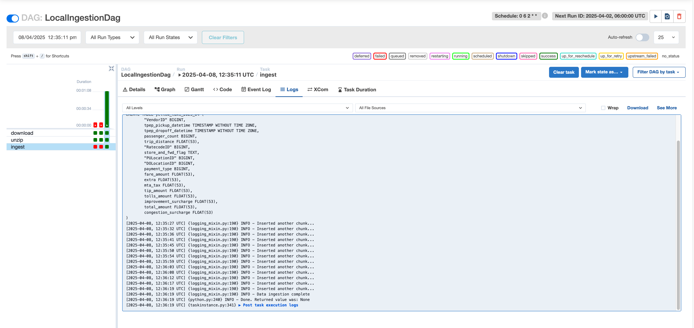
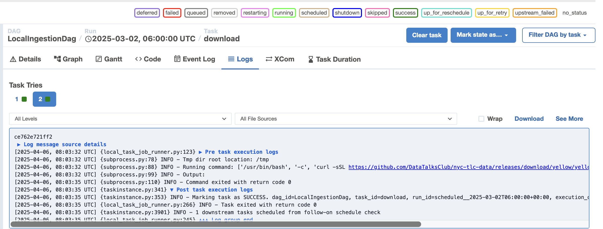

# 2.3.1 Airflow Setup

## Move GCP credentials to $HOME directory

Currently the keys are under `01_docker_terraform > 1_terraform > keys` and we are required to move to the home directory of the machine

```bash
mv "<location_of_keys>" "$HOME/google_credentials.json" 
```

```bash
## Export to .zshrc
echo 'export GOOGLE_APPLICATION_CREDENTIALS="$HOME/google_credentials.json"' >> ~/.zshrc

## Reload file
source ~/.zshrc
```

Finally check if the Google application credentials are present in the local machine `echo $GOOGLE_APPLICATION_CREDENTIALS`


## Set the Airflow user (Mac)

On Linux, the quick-start needs to know your host user-id and needs to have group id set to 0. 
Otherwise the files created in `dags`, `logs` and `plugins` will be created with root user. 
You have to make sure to configure them for the docker-compose:

```bash
mkdir -p ./dags ./logs ./plugins
echo -e "AIRFLOW_UID=$(id -u)" > .env

## Check the user Id
cat .env
```

## Import the official docker setup file from the latest

Airflow version: 
```shell
curl -LfO 'https://airflow.apache.org/docs/apache-airflow/stable/docker-compose.yaml'
```
OR 

Use the docker-compose file from notes from a peers [github repo](https://github.com/ManuelGuerra1987/data-engineering-zoomcamp-notes/blob/main/2_Workflow-Orchestration-AirFlow/airflow/docker-compose.yaml)

## Ensure Google credentials are being accessed  

Add the following into the `docker-compose.yaml` to ensure google creds are being accessed - 

```yaml

        - GCP_PROJECT_ID=${GCP_PROJECT_ID}
        - GCP_GCS_BUCKET=${GCP_GCS_BUCKET}
        - GOOGLE_APPLICATION_CREDENTIALS=${GOOGLE_APPLICATION_CREDENTIALS}
        - AIRFLOW_CONN_GOOGLE_CLOUD_DEFAULT=${AIRFLOW_CONN_GOOGLE_CLOUD_DEFAULT}
```

The above variables can be accessed in the `.env` file that should be git ignored. 

## Adding dependencies

Ensure the `requirement.txt` is added to included libraries to assist with GCP integration and parquet file manipulation. 

## Docker-compose

1. Build the image (only first-time, or when there's any change in the `Dockerfile`, takes ~15 mins for the first-time):
     ```shell
     docker-compose build
     ```
   
     or (for legacy versions)
   
     ```shell
     docker build .
     ```

 2. Initialize the Airflow scheduler, DB, and other config
    ```shell
    docker-compose up init-airflow
    ```

 3. Kick up the all the services from the container:
    ```shell
    docker-compose up
    ```

 4. In another terminal, run `docker-compose ps` to see which containers are up & running (there should be 7, matching with the services in your docker-compose file).

 5. Login to Airflow web UI on `localhost:8080` with default creds

 6. Run your DAG on the Web Console.

 7. On finishing your run or to shut down the container/s:
    ```shell
    docker-compose down
    ```

    To stop and delete containers, delete volumes with database data, and download images, run:
    ```
    docker-compose down --volumes --rmi all
    ```

    or
    ```
    docker-compose down --volumes --remove-orphans
    ```

 # 2.3.2 Ingesting to Local Postgres

 We create dags to split the pipeline into multiple steps - 

 1) Download
 2) Unzip the file
 3) Ingestion into postgres

 **Download and unzip**

 We are required to download the CSV from the dataTalks club back up from [here](https://github.com/DataTalksClub/nyc-tlc-data/releases/download/yellow/yellow_tripdata_2021-01.csv.gz')


Since the csv is in a zipped format, we are required to unzip it in a different step. 


## `Ingest_data` script

We will use the ingest data script from module 1, after making some changes to it. 

We are adding the following fields to the `.env` and passing it into the `docker-compose`. Additionally we are even fetching the params into the ingest script 

```bash
PG_HOST
PG_USER
PG_PASSWORD
PG_PORT
PG_DATABASE
```

## Postgres

We are using the same postgres from our week 1. Remember that airflow also uses postgres that is currently in the docker-compose

Our postgres for the ny-taxi data will be present in `./database_ny_taxi/docker-compose-week1.yaml`

We will be adding an external network configuration for our `pgdatabase` network to interact with the `airflow` network 

```YAML
networks:
  airflow:
    external: true
    name: airflow2025_default
```

### Start the containers

To allow Airflow and PostgreSQL (ny_taxi) services to talk to each other across different docker-compose files, we created a shared external Docker network named `airflow2025_default`.
```

                    +---------------------------+
                    |     Docker Network        |
                    |   airflow2025_default     |
                    +-----------+---------------+
                                |
          +---------------------+----------------------+
          |                                            |
+-------------------------+              +------------------------------+
|   Airflow Services      |              |  Postgres Service (ny_taxi)     |
|   - webserver           |              | - database_ny_taxi-pgdatabase-1 |
|   - scheduler           |              |                                 |
|   - init-airflow        |              |                                 |
+-------------------------+              +------------------------------+

```

1) How to create this network? 

```bash
docker network create airflow2025_default
```

We will not need to create this everytime, unless we reset docker. 

2) Configure your docker-compose.yml to use the shared network

Add this block to the bottom of your `docker-compose.yml` file

```yaml
networks:
  airflow:
    external: true
    name: airflow2025_default
```

3) Attach all services to the `airflow2025_default` network. For each service in your `docker-compose.yml`, make sure the networks section is added

4) Remove old networks. For example `docker network rm airflow_default`

5) Navigate to `.02_workflow_orchestration/airflow/` 

```bash
# Run in detached mode
docker-compose up -d
```

6) Navigate to `02_workflow_orchestration/airflow/database_ny_taxi/`

```bash
docker-compose -f docker-compose-week1.yaml up -d
```

7) Verify if all the services are present within the same network

```bash
docker inspect airflow2025_default
```

### Postgres Troubleshooting

1) Login to postgres by running the command 

```bash
pgcli -h 
localhost -p 5432 -U root2 -d ny_taxi
```


2) `.env` variables are being set in TWO places - with the `docker-compose.yaml` and `docker-compose-week1.yaml`. This ensures the PG details are being passed correctly across the docker network. 

## Run in Local Airflow

View the local DAG after completing the tasks in the airflow!



## Airflow troubleshooting 



The above image shows us that the DAG has successfully downloaded the file. However, we have no way to debug the output file using Airflow. 

In our case, the `airflow-schedule` worker container does the airflow task. Finding the `output.csv` in the container would help us to debug the output. 

To reach the worker -

```shell
# Find the container hash
docker ps

# ssh in the container 
docker exec -it <worker_hash> bash

# Look into the output.csv
more output.csv
```


