# Module 3

This section covers different data warehousing techniques using BigQuery

## 3.1.1 Data Warehouse and BigQuery

### Data Warehouse

_[Video source](https://www.youtube.com/watch?v=jrHljAoD6nM)_

### OLAP vs OLTP

* OLTP: Online transaction processing
* OLAP: Online analytical processing.

You can use OLTP databases in your backend services where you want to group a couple of SQL queries together and roll back in case one of them fails.
OLAP is designed for a different purpose. OLAP is used for putting a lot of data in and discovering hidden insights. They are mainly used for analytical purposes by data analysts or data scientists.

In OLTP, the updates are fast but small, whereas in OLAP, the data is periodically refreshed, and the data size is generally much larger in comparison to OLTP.

When we look at database design, in OLTP, it's generally normalized data for efficiency, whereas in OLAP, it's denormalized databases.

|   | OLTP | OLAP |
|---|---|---|
| Purpose | Control and run essential business operations in real time | Plan, solve problems, support decisions, discover hidden insights |
| Data updates | Short, fast updates initiated by user | Data periodically refreshed with scheduled, long-running batch jobs |
| Database design | Normalized databases for efficiency | Denormalized databases for analysis |
| Space requirements | Generally small if historical data is archived | Generally large due to aggregating large datasets |
| Backup and recovery | Regular backups required to ensure business continuity and meet legal and governance requirements | Lost data can be reloaded from OLTP database as needed in lieu of regular backups |
| Productivity | Increases productivity of end users | Increases productivity of business managers, data analysts and executives |
| Data view | Lists day-to-day business transactions | Multi-dimensional view of enterprise data |
| User examples | Customer-facing personnel, clerks, online shoppers | Knowledge workers such as data analysts, business analysts and executives |

### What is a Data Warehouse?

A **Data Warehouse** (DW) is an ***OLAP solution*** meant for ***reporting and data analysis***

A data warehouse is a centralized system designed to store, organize, and manage large amounts of structured data collected from various sources (databases, APIs, applications). It is specifically optimized for querying, analyzing, and reporting.

Data is typically organized into tables with predefined schemas and is often stored in a denormalized format to optimize query performance. Data is transformed to match the warehouse's format and standards and consolidates data from multiple sources into a single view.

A data warehouse can be transformed into data marts. A data mart is a smaller, focused subset of a data warehouse, designed for a specific business line or department, such as sales, marketing, or finance.

Examples of popular data warehouses include Amazon Redshift, Google BigQuery, Snowflake, and Microsoft Azure Synapse Analytics.

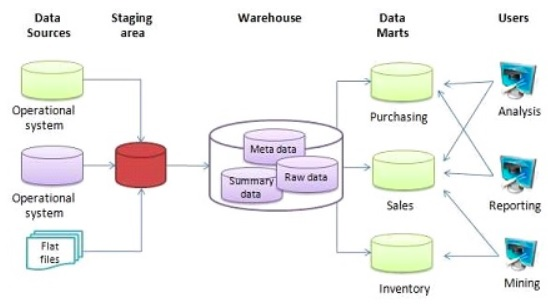

### Big Query

BigQuery is a fully managed, serverless, and highly scalable cloud-based data warehouse offered by Google Cloud. It allows organizations to store, analyze, and query massive amounts of data efficiently. Key features:

- Serverless Architecture: There are no servers to manage or database software to install. Google handles all backend operations, like scaling, performance tuning, and maintenance.

- Scalability and high availability: It can process terabytes and petabytes of data quickly, leveraging Google's distributed architecture.

- SQL Querying: BigQuery uses a SQL-like syntax, making it familiar and easy to write queries.

- Built-in features like Machine Learning, Geospatial Analysis and Business Intelligence among others.

- Maximizes flexibility: Generally, when you have one big server with storage and compute together once your data size increases, your machine has to grow with it. Big Query takes advantage of separating the compute engine
and analyzes your data on a separate storage of your choice that's a huge win in terms of cost.

### Big Query interface

Let's look at the interface of Big Query. In this example, "taxi-rids-ny" is our project, "nytaxi" is our dataset
and external_yellow_tripdata/external_yellow_tripdata_2019 are our tables.

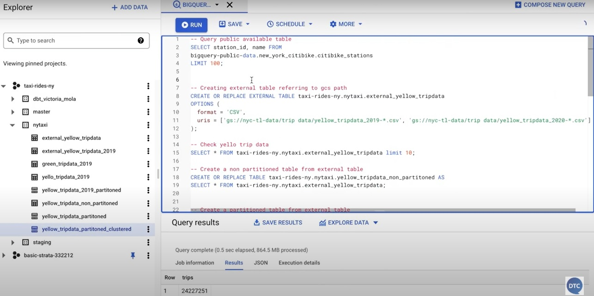

- A project in Google Cloud Platform (GCP) is the fundamental organizing unit for all GCP resources and services. It provides a way to group and manage resources, billing, permissions, and settings.
  
- A dataset in Google BigQuery is a container used to organize and manage tables and views. It serves as a logical grouping of related data and is associated with a specific project.
  
- Tables: In Google BigQuery, there are several types of tables you can use, each serving different use cases depending on how the data is stored, accessed, or processed. Here’s an overview of the main table types:
  * Native Tables: These are the standard tables where data is stored directly in BigQuery's internal storage.
  * External Tables: These tables allow you to query data stored outside of BigQuery, such as in Google Cloud Storage or Google Drive. Useful for querying large datasets stored externally without incurring storage costs in BigQuery. Example: An external table pointing to CSV files stored in a Cloud Storage bucket.
  * Views: A saved SQL query that acts like a virtual table. 
  * Partitioned Tables: Tables divided into smaller, more manageable chunks based on a specific column. Example: A Logs table partitioned by the log_date column.
  * Clustered Tables: Tables optimized for query performance by organizing data within partitions based on the values of specific columns. Example: A table storing customer orders clustered by customer_id or region.

You can also do a quick preview of your table:

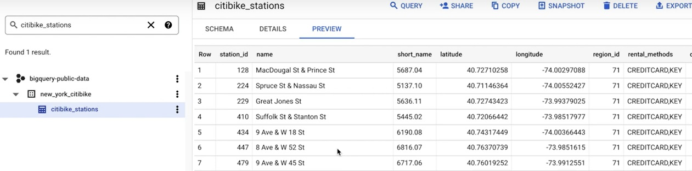

Next, let's quickly query one of our public datasets running this command and as we can see on the bottom here, our query results:

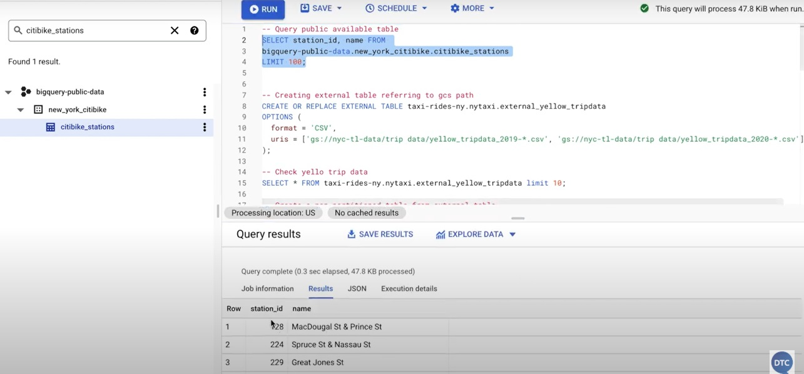

### Creating an external table

We have already created an external table using `airflow` so we would not be needing to do it again. 

Besides, Big Query allows you to create external tables from external sources like Google Cloud Storage.

Let's create an external table named yellow_taxi_2021-01_ext in my dataset ny_taxi from the CSVs of 2019 and 2020:


Let's quickly run this SQL:

```sql
CREATE OR REPLACE EXTERNAL TABLE `de-zoomcamp-00.trips_data_all.yellow_taxi_2021_ext`
OPTIONS (
  format = 'parquet',
  uris = ['gs://de-zoomcamp-00-terra-bucket/raw/output_2021_*.parquet']
);
```

and check the results:

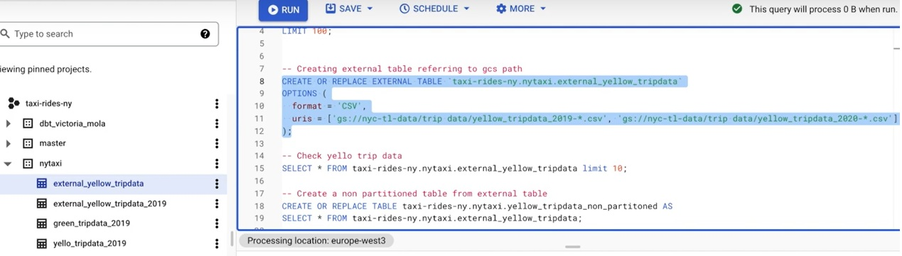

Let's check the table:

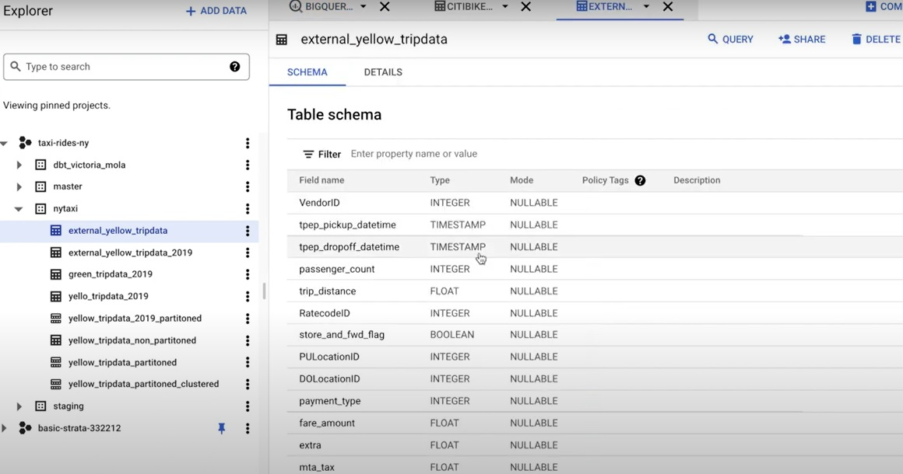

As you can see, all the column names of the CSVs are read and understood by BigQuery. It already knows the data types and can determine if a column is nullable or not.

This is a huge advantage when importing data into BigQuery, as you do not always have to define the schema. However, if needed, you also have the option to define it manually.

Looking at the details, the long-term storage size is zero bytes, and the table size is also zero bytes because the data itself is not stored inside BigQuery; it remains in an external system such as Google Cloud Storage: 

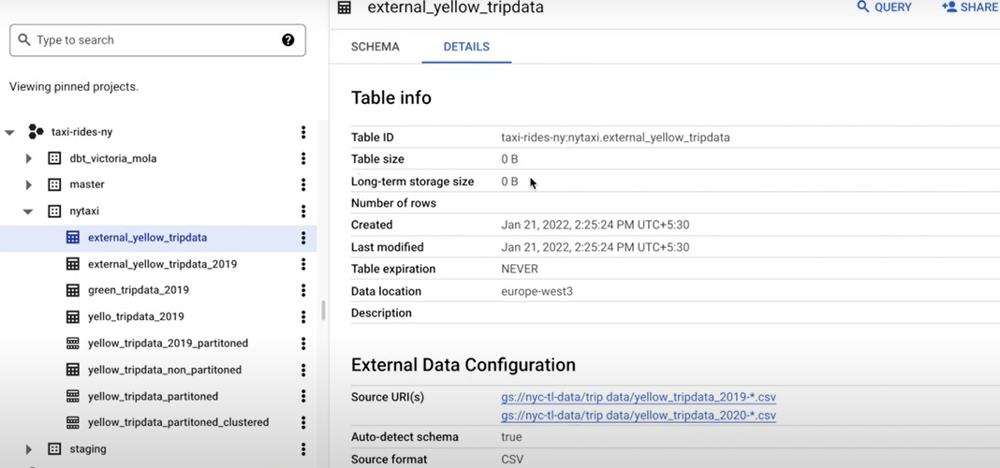

Now that we have created our external table, let's run this query:

```sql
SELECT * FROM `de-zoomcamp-00.trips_data_all.yellow_taxi_2021_ext` LIMIT 10;
```

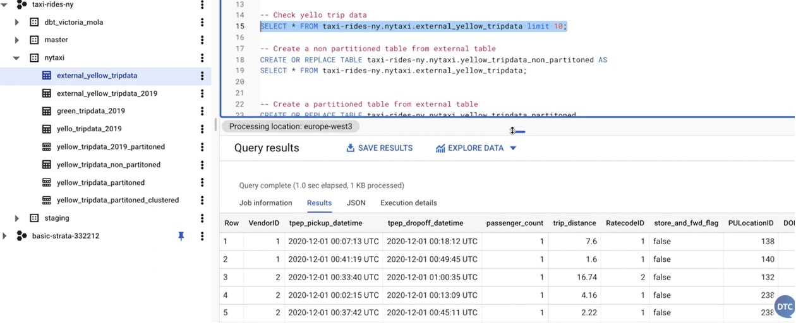

## 3.1.2 Partitioning and Clustering

### Table partitioning

In Google BigQuery, table partitioning is a feature that allows you to divide a large table into smaller, manageable pieces, called partitions. This division is based on a specific column, typically a date or timestamp, or on integer range values. Partitioning is primarily used to improve query performance and reduce costs by allowing you to query only the relevant partitions instead of scanning the entire table.

So how will a partitioned table look when we partition it by creation date?

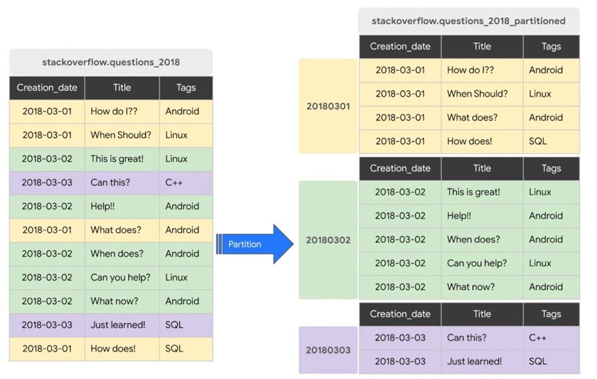

this is really powerful because once BigQuery understands that it only needs to get the data for 2nd of March 2018, it will not read or process any data of 1st of March 2018 or 3rd of March 2018.

### Creating a partitioned table

First, let's create a non-partitioned table. This will help us see the performance improvements once we partition our data.

From our external table, let's create a non-partitioned table by directly copying all its content to a table called yellow_taxi_2021_non_partitioned

Let's run this query:

```sql
CREATE OR REPLACE TABLE de-zoomcamp-00.trips_data_all.yellow_tripdata_non_partitoned AS
SELECT *  FROM `de-zoomcamp-00.trips_data_all.yellow_taxi_2021_ext`;
```

This took about 15 seconds to create a table and is taking up 178 MB in the non partitioned table. 

Now let's create a partitioned table. Let's run this query:

```sql
CREATE OR REPLACE TABLE de-zoomcamp-00.trips_data_all.yellow_taxi_2021_partitioned
PARTITION BY
  DATE(tpep_pickup_datetime) AS
SELECT * FROM de-zoomcamp-00.trips_data_all.yellow_taxi_2021_ext;
```

This took slightly longer to run as it contain partitioning. 

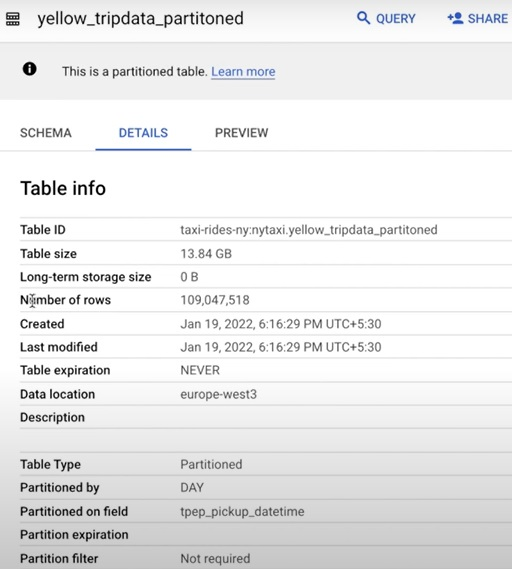


In this use case, selecting all the distinct vendor IDs from the non-partitioned table between 1st of June and 30th of June, we can see on the right-hand side at the top that this query will process 1.6 gigabytes of data:

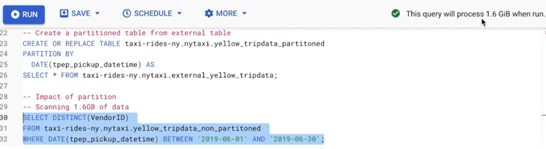

For our partitioned table, the same query will process about 106 megabytes of data. That's a huge advantage if you want to run this query repeatedly which directly impacts your cost:

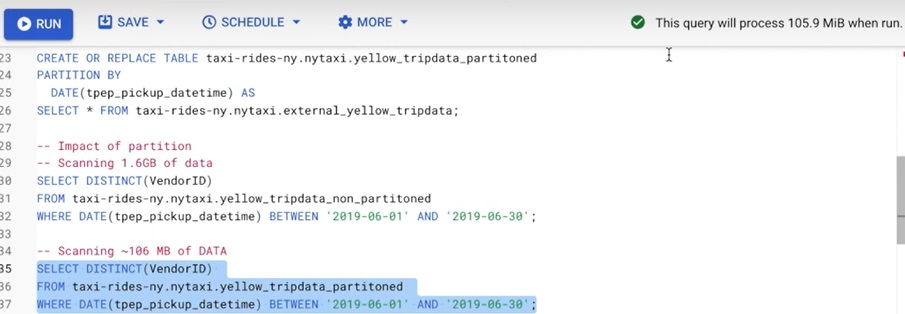

Moreover we can actually take a look into the partitions generally each data set has information schema table which has a partitions once we select this we can actually see how many rows are falling into which partition.

Moreover we can actually take a look into the partitions generally each data set has information schema table which has a partitions once we select this we can actually see how many rows are falling into which partition.

Let's run this query:

```sql
SELECT table_name, partition_id, total_rows
FROM `de-zoomcamp-00.trips_data_all.INFORMATION_SCHEMA.PARTITIONS`
WHERE table_name = 'yellow_taxi_2021_partitioned'
ORDER BY total_rows DESC;
```
partitions looks like this:

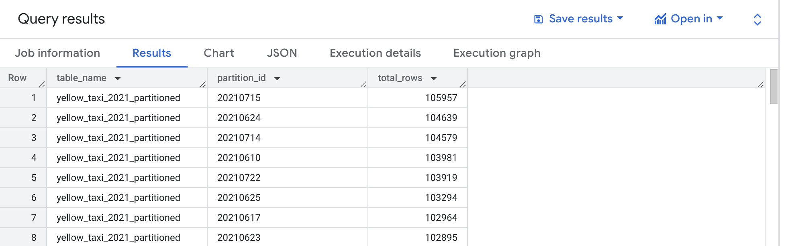

### Clustering a table

Clustering in BigQuery is a method used to optimize query performance and reduce costs by organizing data in a table based on the values in one or more columns. When you cluster a BigQuery table, rows with similar values in the clustering columns are stored together.

- Clustering is applied to a table that's already partitioned (clustering works on top of partitions).
- You define up to four clustering columns when creating or altering a table.
- BigQuery organizes the data based on these columns.

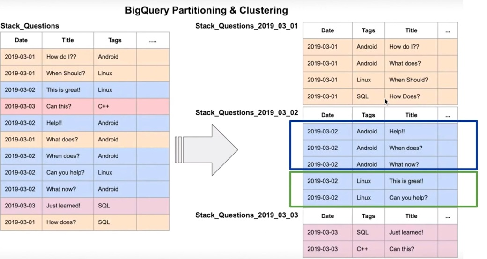

You can see this is a similar structure to the partitioned table but we have also clustered by the tag

Moving to our example,

We have created a partitioned table which is partitioned by pickupdatetime. Let's create a clustered table by vendor_id. The reason for choosing a cluster by vendor_id depends on how you want to query the data.

Let's create a partitioned and clustered table running this query:

```sql
CREATE OR REPLACE TABLE de-zoomcamp-00.trips_data_all.yellow_taxi_2021_partitoned_clustered
PARTITION BY DATE(tpep_pickup_datetime)
CLUSTER BY VendorID AS
SELECT * FROM de-zoomcamp-00.trips_data_all.yellow_taxi_2021_ext;
```

Now, let's take a quick look at a comparison between a partitioned table and a partitioned and clustered table:

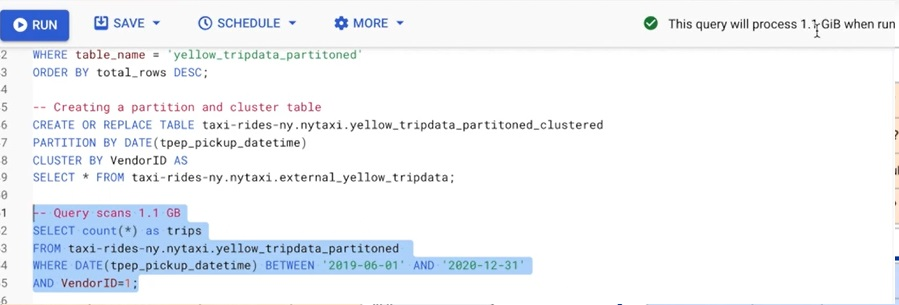

In this use case, I am counting all the rows which are in my partition table between the pickupdatetime of 1st of June 2019 and 31st of December 2020, which comes from vendor_id = 1. On the right-hand side, top, we can see that it will process 1.1 gigabytes of data.

Let's run the same query on our partitioned and clustered table:

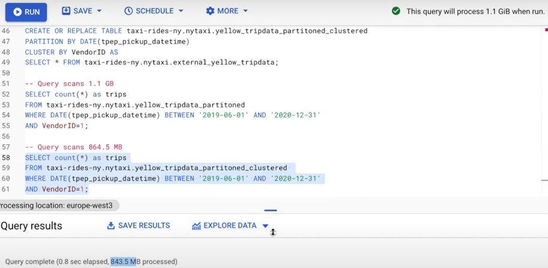

Before running this, we can see that the approximation is 1.1 gigabytes, but when we run this query, we can notice that less data is being processed.

The final processed data shows that it only processed 843 megabytes of data in comparison to 1.1 gigabytes.

### Diving deeper on Partitioning and Clustering

we explored how to create partitioned and clustered tables. In this video, we'll dive deeper into partitioning and clustering in BigQuery.

**Big Query Partitioning**

When creating a partitioned table in BigQuery, you can choose between:

- Time unit column
- Ingestion time
- An integer range partitioning

When using Time Unit or Ingestion Time you can partition by daily, hourly, monthly, or yearly time units. Daily is the default and works well when data is medium-sized and evenly distributed across days. Use hourly partitioning when dealing with large amounts of data arriving hourly, enabling more granular data processing. Monthly or yearly partitioning is typically for smaller data volumes spread over a longer time range.

Be cautious about the number of partitions—BigQuery allows a maximum of 4,000 partitions per table.

**Big Query Clustering**

- In clustering, the specified columns are co-located, and their order determines the sort order of the data. For example, clustering by columns A, B, and C will sort data by A first, then B, and finally C.

- Clustering improves filtering and aggregate query performance, especially for clustered columns.

- Clustering is less effective for small datasets (e.g., under 1 GB), where partitioning or clustering adds metadata overhead and costs.

- You can specify up to four clustering columns, which must be top-level, non-repeated columns

- Supported data types for clustering columns include date, boolean, geography, int, numeric, string, and datetime.

**Partitioning vs Clustering**

You may combine both partitioning and clustering in a table, but there are important differences between both techniques that you need to be aware of in order to decide what to use for your specific scenario:

| Clustering | Partitioning |
|---|---|
| Cost benefit unknown. BQ cannot estimate the reduction in cost before running a query. | Cost known upfront. BQ can estimate the amount of data to be processed before running a query. |
| High granularity. Multiple criteria can be used to sort the table. | Low granularity. Only a single column can be used to partition the table. |
| Benefits from queries that commonly use filters or aggregation against multiple particular columns. | Benefits when you filter or aggregate on a single column. |
| No partition limit | Limited to 4000 partitions|


**When to Use Clustering Over Partitioning:**

- When partitioning results in small data sizes per partition (e.g., under 1 GB). If your partitions are really small or your column has a high amount of granularity then using clustering makes more sense.
- When partitioning would result in over 4000 partitions.
- If frequent modifications impact a large number of partitions, clustering may be a better alternative. For example if you are writing data to your bigquery table every hour and that modifies all your partitions then that might not be a good idea.

**Automatic Reclustering**

As the data is added to your cluster table, generally the newly inserted data is written into different blocks, which obviously does not overlap with your clustering strategy. These overlapping key ranges generally weaken the sort property of the table and can increase your query time.

To maintain the performance characteristic of a cluster table, BigQuery performs automatic clustering. This is done in the background, so you generally don't realize this, and it does not impact your query performance.

For partitioned tables, clustering is maintained for data within the scope of each partition, and this is also handled automatically.

Another very important part of automatic clustering is that it doesn't cost the end user anything. It's done in the background by BigQuery itself and has no cost at all.

## 3.2.1 Best practices

_[Video source](https://www.youtube.com/watch?v=k81mLJVX08w)_

**Cost reduction:**

* Avoid `SELECT *` . You should generally specify the name of the columns. Reducing the amount of columns to display will drastically reduce the amount of processed data and lower costs.

* Price your queries before running them.

* Use clustered and/or partitioned tables if possible. They help a lot in terms of cost reduction.

* Use streaming inserts with caution. If you are doing streaming inserts use them with caution
they can actually increase your cost drastically.

* Materialize query results in stages: Is a best practice in BigQuery that involves breaking down complex queries into smaller, intermediate steps by storing partial results in temporary or permanent tables. This approach can improve query performance, reduce costs, and simplify debugging and maintenance.


  Example: Materialize query results in stages example

  Suppose you have a query that computes: Total sales per product and top-selling products per region.

  ```sql

  WITH total_sales AS (
    SELECT 
      product_id,
      region,
      SUM(sales_amount) AS total_sales
    FROM 
      sales_data
    GROUP BY 
      product_id, region
  ),
  top_sellers AS (
    SELECT 
      region,
      product_id,
      total_sales
    FROM 
      total_sales
    WHERE 
      total_sales = (SELECT MAX(total_sales) FROM total_sales WHERE region = total_sales.region)
  )
  SELECT * FROM top_sellers;

  ```

  This query is complex and may repeatedly scan sales_data. Let's apply Materialization.

  Step 1: Materialize intermediate results into a table:

  ```sql

  CREATE OR REPLACE TABLE intermediate_sales AS
  SELECT 
    product_id,
    region,
    SUM(sales_amount) AS total_sales
  FROM 
    sales_data
  GROUP BY 
    product_id, region;
  ```

  Step 2: Use the materialized table in the final query:

  ```sql
  SELECT 
    region,
    product_id,
    total_sales
  FROM 
    intermediate_sales
  WHERE 
    total_sales = (
      SELECT MAX(total_sales) 
      FROM intermediate_sales 
      WHERE region = intermediate_sales.region
    );
  ```


**Query performance:**

* Filter on partitioned columns. You should always filter on the partitioned column or clustered column.

* Denormalize data: is the process of restructuring a database to reduce the need for joins between tables by combining related data into a single table or using nested/repeated fields. 

* Use nested or repeated columns: In case you have a complicated structure, you should use nested or repeated columns that will help you in denormalizing your data. Are features in BigQuery that allow you to store complex, hierarchical data structures directly within a table. These columns enable you to represent relationships within data in a single table, reducing the need for joins and improving query efficiency. Nested Columns store structured data as an object (a single field containing multiple subfields). Repeated Columns store arrays of data within a single field, allowing for multiple values. These features are part of BigQuery's support for semi-structured data and are particularly useful when working with hierarchical or JSON-like data formats.


  Example of Table with Nested Data:

  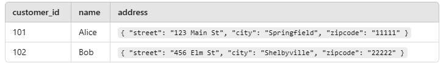

  You can query the nested fields directly:

  ```sql

  SELECT 
    name,
    address.city,
    address.zipcode
  FROM 
    customers;

  ```

  Example of Table with Repeated Data:

  Suppose you have an orders table where each order contains multiple items

  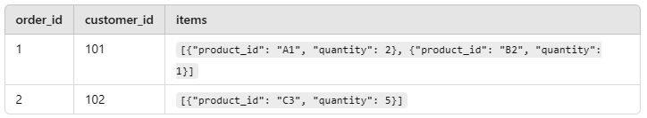

  Here, the items column is an array of structs, where each struct contains product_id and quantity.

  To query repeated fields, you use the UNNEST function to flatten arrays for processing. For example if you want to list all items in all orders:

  ```sql

  SELECT 
    order_id,
    items.product_id,
    items.quantity
  FROM 
    orders,
    UNNEST(items) AS items;

  ```

  result:

  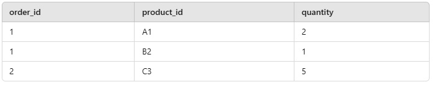


* Use external data sources appropiately. Constantly reading data from a bucket may incur in additional costs and has worse performance.

* Reduce data before using a `JOIN`: Refers to the practice of minimizing the amount of data that needs to be joined by applying filters, aggregations, or other data reduction techniques before performing the join operation. The main idea is to reduce the size of the datasets as much as possible before performing the JOIN to avoid unnecessary processing and reduce the computational load. By applying filters or aggregations on the individual tables, you can minimize the amount of data that will be involved in the join operation.

  How to Reduce Data Before Using a JOIN? Use WHERE Clauses (Filtering), apply Aggregation Before JOIN If possible (e.g., using SUM, AVG, COUNT), Limit Data with Subqueries.

* Do not threat `WITH` clauses as prepared statements: You should not assume that WITH clauses provide the same performance benefits as prepared statements. Prepared statements are precompiled queries that allow you to efficiently execute the same query with different parameters multiple times. They are optimized once, and the database uses that execution plan for all future executions with different input values. However, CTEs (WITH clauses) do not work the same way as prepared statements, and they may not provide the same performance benefits in certain cases.

  WITH clauses are not cached or optimized for repeated execution with different parameters, unlike prepared statements. Instead, you should use Common Table Expressions (CTEs) for structuring complex queries and use prepared statements when executing the same query multiple times with different parameters.

  A Common Table Expression (CTE) is a temporary result set defined within the scope of a SELECT, INSERT, UPDATE, or DELETE statement. It allows you to write more readable and modular queries, especially when you need to use the same subquery multiple times within a query.

  Example of a WITH clause (CTE):

  ```sql

  WITH total_sales AS (
    SELECT product_id, SUM(sales_amount) AS total
    FROM sales
    GROUP BY product_id
  )
  SELECT p.product_name, ts.total
  FROM products p
  JOIN total_sales ts ON p.product_id = ts.product_id;

  ```
  A prepared statement is a feature provided by most relational database management systems (RDBMS) to allow a query to be precompiled and optimized once, before being executed multiple times with different parameters. The main benefit is performance, especially for repeated executions with varying values.

  Example of a prepared statement:

  ```sql

  PREPARE stmt FROM 'SELECT product_id, SUM(sales_amount) AS total FROM sales WHERE product_id = ? GROUP BY product_id';
  EXECUTE stmt USING @product_id;

  ```

  Unlike prepared statements, CTEs are not cached in most databases. This means that the query within the WITH clause is re-executed every time it is referenced in the main query. In contrast, prepared statements are compiled once and stored, leading to faster repeated executions.


* Avoid oversharding tables: Refers to the practice of splitting (sharding) a table into too many partitions or subsets, which can result in inefficiencies in database performance and complicate database management. In database systems, sharding is the process of dividing a large table into smaller, more manageable pieces called shards or partitions.

  While sharding can improve performance and scalability by distributing data across multiple machines, oversharding occurs when you divide the data into too many smaller pieces than necessary.

* Avoid JavaScript user-defined functions: In BigQuery, JavaScript user-defined functions (UDFs) allow you to write custom functions using JavaScript that can be executed within SQL queries. While this can be powerful for custom logic, it's generally recommended to avoid using JavaScript UDFs in BigQuery. JavaScript UDFs are generally slower than native SQL functions.

  Example of Using JavaScript UDFs in BigQuery:

  ```sql

  CREATE FUNCTION my_square(num INT64)
  RETURNS INT64
  LANGUAGE js AS """
    return num * num;
  """;

  ```

  You would then use this UDF in a query like:

  ```sql

  SELECT my_square(4) AS squared_value;

  ```

  While this works, you can see that the calculation of a square can be done more efficiently using BigQuery’s built-in mathematical functions, like so:

  ```sql

  SELECT POW(4, 2) AS squared_value;

  ```

  The native POW function will be much faster, as it’s a built-in, optimized function within BigQuery.

* Use approximate aggregation functions: In BigQuery, approximate aggregation functions are a set of functions that allow you to calculate certain aggregate values in a faster and more cost-effective way, with a slight trade-off in accuracy. These functions are specifically designed for large datasets, where calculating exact results can be resource-intensive and time-consuming. By using approximate functions, you can get results much quicker and at a lower cost, which is especially useful for exploratory data analysis or when perfect accuracy is not required.

  BigQuery provides several approximate aggregation functions that are commonly used for different types of analyses:

  APPROX_COUNT_DISTINCT: This function is used to calculate the approximate number of distinct values in a column. For large datasets, using COUNT(DISTINCT column) can be computationally expensive because it requires scanning all rows and maintaining unique values. APPROX_COUNT_DISTINCT uses algorithms like HyperLogLog to provide a faster, approximate result.

  Example:

  ```sql

  SELECT APPROX_COUNT_DISTINCT(user_id) AS approx_distinct_users
  FROM sales_data;

  ```


* Order statements should be the last part of the query: The general rule of thumb is that the ORDER BY clause should be placed at the end of your query. This practice helps ensure that the query is executed in the most efficient manner, especially when dealing with complex queries or large datasets.


* Optimize join patterns: A good practice in optimizing joins is to order your tables by size. The general rule is to place the largest table first and the smallest table second in the JOIN clause.

  INNER JOIN is often the most efficient, as it only returns rows where there is a match between the two tables.

  When performing joins, try to join tables on columns that are indexed or partitioned. This allows BigQuery to more efficiently locate the relevant rows during the join operation.

  Avoid Cross Joins: A CROSS JOIN returns the Cartesian product of two tables, meaning it joins every row of the first table with every row of the second table. This can lead to an extremely large result set and can be very expensive in terms of both time and cost.

  If possible, filter out unnecessary rows from your tables before performing the join. By applying filters early in the query (with WHERE clauses), you reduce the amount of data that needs to be processed during the join operation.


* Place the table with the _largest_ number of rows first, followed by the table with the _fewest_ rows, and then place the remaining tables by decreasing size. This is due to how BigQuery works internally: the first table will be distributed evenly and the second table will be broadcasted to all the nodes. 

**Query performance:**

* Filter on partitioned columns. You should always filter on the partitioned column or clustered column.

* Denormalize data: is the process of restructuring a database to reduce the need for joins between tables by combining related data into a single table or using nested/repeated fields. 

* Use nested or repeated columns: In case you have a complicated structure, you should use nested or repeated columns that will help you in denormalizing your data. Are features in BigQuery that allow you to store complex, hierarchical data structures directly within a table. These columns enable you to represent relationships within data in a single table, reducing the need for joins and improving query efficiency. Nested Columns store structured data as an object (a single field containing multiple subfields). Repeated Columns store arrays of data within a single field, allowing for multiple values. These features are part of BigQuery's support for semi-structured data and are particularly useful when working with hierarchical or JSON-like data formats.


  Example of Table with Nested Data:

  

  You can query the nested fields directly:

  ```sql

  SELECT 
    name,
    address.city,
    address.zipcode
  FROM 
    customers;

  ```

  Example of Table with Repeated Data:

  Suppose you have an orders table where each order contains multiple items

  

  Here, the items column is an array of structs, where each struct contains product_id and quantity.

  To query repeated fields, you use the UNNEST function to flatten arrays for processing. For example if you want to list all items in all orders:

  ```sql

  SELECT 
    order_id,
    items.product_id,
    items.quantity
  FROM 
    orders,
    UNNEST(items) AS items;

  ```

  result:

  


* Use external data sources appropiately. Constantly reading data from a bucket may incur in additional costs and has worse performance.

* Reduce data before using a `JOIN`: Refers to the practice of minimizing the amount of data that needs to be joined by applying filters, aggregations, or other data reduction techniques before performing the join operation. The main idea is to reduce the size of the datasets as much as possible before performing the JOIN to avoid unnecessary processing and reduce the computational load. By applying filters or aggregations on the individual tables, you can minimize the amount of data that will be involved in the join operation.

  How to Reduce Data Before Using a JOIN? Use WHERE Clauses (Filtering), apply Aggregation Before JOIN If possible (e.g., using SUM, AVG, COUNT), Limit Data with Subqueries.

* Do not threat `WITH` clauses as prepared statements: You should not assume that WITH clauses provide the same performance benefits as prepared statements. Prepared statements are precompiled queries that allow you to efficiently execute the same query with different parameters multiple times. They are optimized once, and the database uses that execution plan for all future executions with different input values. However, CTEs (WITH clauses) do not work the same way as prepared statements, and they may not provide the same performance benefits in certain cases.

  WITH clauses are not cached or optimized for repeated execution with different parameters, unlike prepared statements. Instead, you should use Common Table Expressions (CTEs) for structuring complex queries and use prepared statements when executing the same query multiple times with different parameters.

  A Common Table Expression (CTE) is a temporary result set defined within the scope of a SELECT, INSERT, UPDATE, or DELETE statement. It allows you to write more readable and modular queries, especially when you need to use the same subquery multiple times within a query.

  Example of a WITH clause (CTE):

  ```sql

  WITH total_sales AS (
    SELECT product_id, SUM(sales_amount) AS total
    FROM sales
    GROUP BY product_id
  )
  SELECT p.product_name, ts.total
  FROM products p
  JOIN total_sales ts ON p.product_id = ts.product_id;

  ```
  A prepared statement is a feature provided by most relational database management systems (RDBMS) to allow a query to be precompiled and optimized once, before being executed multiple times with different parameters. The main benefit is performance, especially for repeated executions with varying values.

  Example of a prepared statement:

  ```sql

  PREPARE stmt FROM 'SELECT product_id, SUM(sales_amount) AS total FROM sales WHERE product_id = ? GROUP BY product_id';
  EXECUTE stmt USING @product_id;

  ```

  Unlike prepared statements, CTEs are not cached in most databases. This means that the query within the WITH clause is re-executed every time it is referenced in the main query. In contrast, prepared statements are compiled once and stored, leading to faster repeated executions.


* Avoid oversharding tables: Refers to the practice of splitting (sharding) a table into too many partitions or subsets, which can result in inefficiencies in database performance and complicate database management. In database systems, sharding is the process of dividing a large table into smaller, more manageable pieces called shards or partitions.

  While sharding can improve performance and scalability by distributing data across multiple machines, oversharding occurs when you divide the data into too many smaller pieces than necessary.

* Avoid JavaScript user-defined functions: In BigQuery, JavaScript user-defined functions (UDFs) allow you to write custom functions using JavaScript that can be executed within SQL queries. While this can be powerful for custom logic, it's generally recommended to avoid using JavaScript UDFs in BigQuery. JavaScript UDFs are generally slower than native SQL functions.

  Example of Using JavaScript UDFs in BigQuery:

  ```sql

  CREATE FUNCTION my_square(num INT64)
  RETURNS INT64
  LANGUAGE js AS """
    return num * num;
  """;

  ```

  You would then use this UDF in a query like:

  ```sql

  SELECT my_square(4) AS squared_value;

  ```

  While this works, you can see that the calculation of a square can be done more efficiently using BigQuery’s built-in mathematical functions, like so:

  ```sql

  SELECT POW(4, 2) AS squared_value;

  ```

  The native POW function will be much faster, as it’s a built-in, optimized function within BigQuery.

* Use approximate aggregation functions: In BigQuery, approximate aggregation functions are a set of functions that allow you to calculate certain aggregate values in a faster and more cost-effective way, with a slight trade-off in accuracy. These functions are specifically designed for large datasets, where calculating exact results can be resource-intensive and time-consuming. By using approximate functions, you can get results much quicker and at a lower cost, which is especially useful for exploratory data analysis or when perfect accuracy is not required.

  BigQuery provides several approximate aggregation functions that are commonly used for different types of analyses:

  APPROX_COUNT_DISTINCT: This function is used to calculate the approximate number of distinct values in a column. For large datasets, using COUNT(DISTINCT column) can be computationally expensive because it requires scanning all rows and maintaining unique values. APPROX_COUNT_DISTINCT uses algorithms like HyperLogLog to provide a faster, approximate result.

  Example:

  ```sql

  SELECT APPROX_COUNT_DISTINCT(user_id) AS approx_distinct_users
  FROM sales_data;

  ```


* Order statements should be the last part of the query: The general rule of thumb is that the ORDER BY clause should be placed at the end of your query. This practice helps ensure that the query is executed in the most efficient manner, especially when dealing with complex queries or large datasets.


* Optimize join patterns: A good practice in optimizing joins is to order your tables by size. The general rule is to place the largest table first and the smallest table second in the JOIN clause.

  INNER JOIN is often the most efficient, as it only returns rows where there is a match between the two tables.

  When performing joins, try to join tables on columns that are indexed or partitioned. This allows BigQuery to more efficiently locate the relevant rows during the join operation.

  Avoid Cross Joins: A CROSS JOIN returns the Cartesian product of two tables, meaning it joins every row of the first table with every row of the second table. This can lead to an extremely large result set and can be very expensive in terms of both time and cost.

  If possible, filter out unnecessary rows from your tables before performing the join. By applying filters early in the query (with WHERE clauses), you reduce the amount of data that needs to be processed during the join operation.


* Place the table with the _largest_ number of rows first, followed by the table with the _fewest_ rows, and then place the remaining tables by decreasing size. This is due to how BigQuery works internally: the first table will be distributed evenly and the second table will be broadcasted to all the nodes.