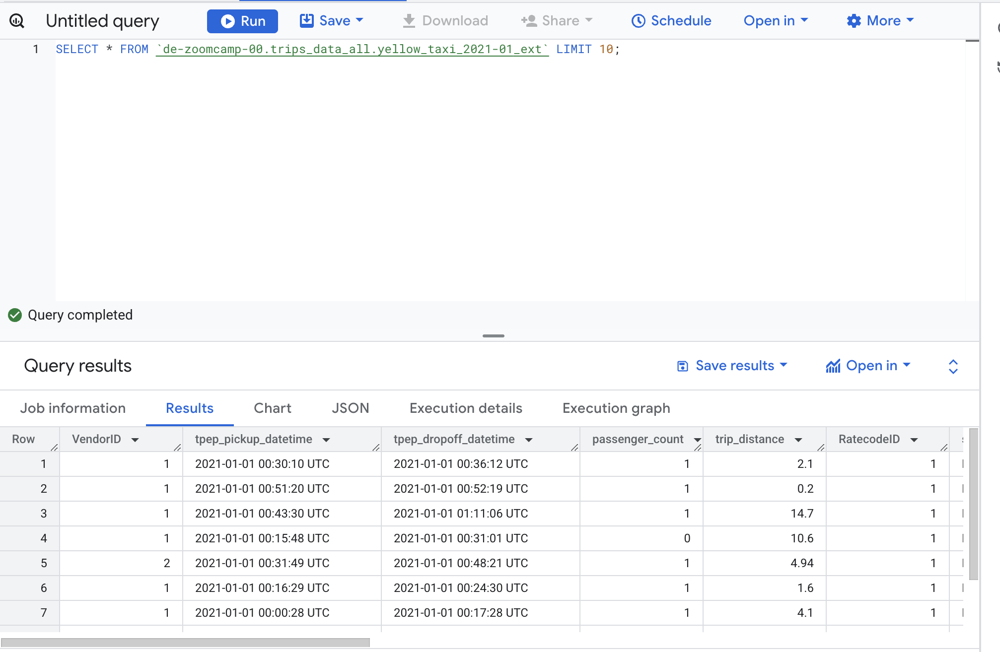
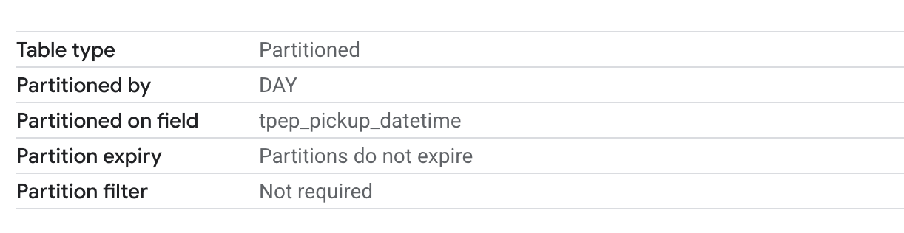

# Module 3

This section covers different data warehousing techniques using BigQuery

## 3.1.1 Data Warehouse and BigQuery

### Data Warehouse

_[Video source](https://www.youtube.com/watch?v=jrHljAoD6nM)_

### OLAP vs OLTP

* OLTP: Online transaction processing
* OLAP: Online analytical processing.

You can use OLTP databases in your backend services where you want to group a couple of SQL queries together and roll back in case one of them fails.
OLAP is designed for a different purpose. OLAP is used for putting a lot of data in and discovering hidden insights. They are mainly used for analytical purposes by data analysts or data scientists.

In OLTP, the updates are fast but small, whereas in OLAP, the data is periodically refreshed, and the data size is generally much larger in comparison to OLTP.

When we look at database design, in OLTP, it's generally normalized data for efficiency, whereas in OLAP, it's denormalized databases.

|   | OLTP | OLAP |
|---|---|---|
| Purpose | Control and run essential business operations in real time | Plan, solve problems, support decisions, discover hidden insights |
| Data updates | Short, fast updates initiated by user | Data periodically refreshed with scheduled, long-running batch jobs |
| Database design | Normalized databases for efficiency | Denormalized databases for analysis |
| Space requirements | Generally small if historical data is archived | Generally large due to aggregating large datasets |
| Backup and recovery | Regular backups required to ensure business continuity and meet legal and governance requirements | Lost data can be reloaded from OLTP database as needed in lieu of regular backups |
| Productivity | Increases productivity of end users | Increases productivity of business managers, data analysts and executives |
| Data view | Lists day-to-day business transactions | Multi-dimensional view of enterprise data |
| User examples | Customer-facing personnel, clerks, online shoppers | Knowledge workers such as data analysts, business analysts and executives |

### What is a Data Warehouse?

A **Data Warehouse** (DW) is an ***OLAP solution*** meant for ***reporting and data analysis***

A data warehouse is a centralized system designed to store, organize, and manage large amounts of structured data collected from various sources (databases, APIs, applications). It is specifically optimized for querying, analyzing, and reporting.

Data is typically organized into tables with predefined schemas and is often stored in a denormalized format to optimize query performance. Data is transformed to match the warehouse's format and standards and consolidates data from multiple sources into a single view.

A data warehouse can be transformed into data marts. A data mart is a smaller, focused subset of a data warehouse, designed for a specific business line or department, such as sales, marketing, or finance.

Examples of popular data warehouses include Amazon Redshift, Google BigQuery, Snowflake, and Microsoft Azure Synapse Analytics.


### Big Query

BigQuery is a fully managed, serverless, and highly scalable cloud-based data warehouse offered by Google Cloud. It allows organizations to store, analyze, and query massive amounts of data efficiently. Key features:

- Serverless Architecture: There are no servers to manage or database software to install. Google handles all backend operations, like scaling, performance tuning, and maintenance.

- Scalability and high availability: It can process terabytes and petabytes of data quickly, leveraging Google's distributed architecture.

- SQL Querying: BigQuery uses a SQL-like syntax, making it familiar and easy to write queries.

- Built-in features like Machine Learning, Geospatial Analysis and Business Intelligence among others.

- Maximizes flexibility: Generally, when you have one big server with storage and compute together once your data size increases, your machine has to grow with it. Big Query takes advantage of separating the compute engine
and analyzes your data on a separate storage of your choice that's a huge win in terms of cost.

### Big Query interface

Let's look at the interface of Big Query. In this example, "taxi-rids-ny" is our project, "nytaxi" is our dataset
and external_yellow_tripdata/external_yellow_tripdata_2019 are our tables.


- A project in Google Cloud Platform (GCP) is the fundamental organizing unit for all GCP resources and services. It provides a way to group and manage resources, billing, permissions, and settings.
  
- A dataset in Google BigQuery is a container used to organize and manage tables and views. It serves as a logical grouping of related data and is associated with a specific project.
  
- Tables: In Google BigQuery, there are several types of tables you can use, each serving different use cases depending on how the data is stored, accessed, or processed. Here’s an overview of the main table types:
  * Native Tables: These are the standard tables where data is stored directly in BigQuery's internal storage.
  * External Tables: These tables allow you to query data stored outside of BigQuery, such as in Google Cloud Storage or Google Drive. Useful for querying large datasets stored externally without incurring storage costs in BigQuery. Example: An external table pointing to CSV files stored in a Cloud Storage bucket.
  * Views: A saved SQL query that acts like a virtual table. 
  * Partitioned Tables: Tables divided into smaller, more manageable chunks based on a specific column. Example: A Logs table partitioned by the log_date column.
  * Clustered Tables: Tables optimized for query performance by organizing data within partitions based on the values of specific columns. Example: A table storing customer orders clustered by customer_id or region.

You can also do a quick preview of your table:


Next, let's quickly query one of our public datasets running this command and as we can see on the bottom here, our query results:


### Creating an external table

We have already created an external table using `airflow` so we would not be needing to do it again. 

Besides, Big Query allows you to create external tables from external sources like Google Cloud Storage.

Let's create an external table named yellow_taxi_2021-01_ext in my dataset ny_taxi from the CSVs of 2019 and 2020:


Let's quickly run this SQL:

```sql

CREATE OR REPLACE EXTERNAL TABLE `trips_data_all.yellow_taxi_2021-01_ext`
OPTIONS (
  format = 'CSV',
  uris = ['gs://<bucket-name>/../2021-*.csv']
);
```

and check the results:


Let's check the table:


As you can see, all the column names of the CSVs are read and understood by BigQuery. It already knows the data types and can determine if a column is nullable or not.

This is a huge advantage when importing data into BigQuery, as you do not always have to define the schema. However, if needed, you also have the option to define it manually.

Looking at the details, the long-term storage size is zero bytes, and the table size is also zero bytes because the data itself is not stored inside BigQuery; it remains in an external system such as Google Cloud Storage: 


Now that we have created our external table, let's run this query:

```sql
SELECT * FROM `de-zoomcamp-00.trips_data_all.yellow_taxi_2021-01_ext` LIMIT 10;
```



## 3.1.2 Partitioning and Clustering

### Table partitioning

In Google BigQuery, table partitioning is a feature that allows you to divide a large table into smaller, manageable pieces, called partitions. This division is based on a specific column, typically a date or timestamp, or on integer range values. Partitioning is primarily used to improve query performance and reduce costs by allowing you to query only the relevant partitions instead of scanning the entire table.

So how will a partitioned table look when we partition it by creation date?


this is really powerful because once BigQuery understands that it only needs to get the data for 2nd of March 2018, it will not read or process any data of 1st of March 2018 or 3rd of March 2018.

### Creating a partitioned table

First, let's create a non-partitioned table. This will help us see the performance improvements once we partition our data.

From our external table, let's create a non-partitioned table by directly copying all its content to a table called yellow_taxi_2021_non_partitioned

Let's run this query:

```sql
CREATE OR REPLACE TABLE de-zoomcamp-00.trips_data_all.yellow_tripdata_non_partitoned AS
SELECT *  FROM `de-zoomcamp-00.trips_data_all.yellow_taxi_2021-01_ext`;
```

This took about 15 seconds to create a table and is taking up 178 MB in the non partitioned table. 

Now let's create a partitioned table. Let's run this query:

```sql
CREATE OR REPLACE TABLE de-zoomcamp-00.trips_data_all.yellow_tripdata_partitoned
PARTITION BY
  DATE(tpep_pickup_datetime) AS
SELECT *  FROM `de-zoomcamp-00.trips_data_all.yellow_taxi_2021-01_ext`;
```

This took slightly longer to run as it contain partitioning. 




In this use case, selecting all the distinct vendor IDs from the non-partitioned table between 1st of June and 30th of June, we can see on the right-hand side at the top that this query will process 1.6 gigabytes of data:


For our partitioned table, the same query will process about 106 megabytes of data. That's a huge advantage if you want to run this query repeatedly which directly impacts your cost:


Moreover we can actually take a look into the partitions generally each data set has information schema table which has a partitions once we select this we can actually see how many rows are falling into which partition.
