# Analytics Engineering

## 4.1.1 Analytics Engineering Basics

In a traditional data team, we recognize the data engineer, the data analyst, and sometimes the data scientist. The data engineer prepares and maintains the infrastructure the data team needs. The data analyst uses the data hosted in that infrastructure to answer questions and solve problems.

With recent developments, data scientists and analysts are writing more code, but they are not trained as software engineers, and this is not their primary focus. Similarly, data engineers, while excellent software engineers, lack training in how the data is used by business users.

This gap is where the analytics engineer comes in. The role combines elements of the data engineer and the data analyst. It introduces good software engineering practices from the data engineer to the efforts of data analysts and scientists.


<br><br>

The analytics engineer may be exposed to the following tools:

- Data Loading (Stitch, Apache NiFi, Airbyte)
- Data Storing (Google BigQuery, Snowflake, Amazon Redshift)
- Data Modeling (dbt, Dataform, Apache Spark SQL)
- Data Presentation (Looker, Tableau, Google Data Studio, Power BI, Metabase)

This module, we’ll focus on the last two areas: data modeling and presentation

### Data Modelling Concepts

**ETL vs. ELT**

In ETL, we extract the sources, transform the data, and then load it into a data warehouse. In ELT, we load the data into the data warehouse first and then transform it.

The first approach takes longer to implement because we must transform the data upfront. However, this results in more stable and compliant data because it is clean. On the other hand, ELT is faster and more flexible because the data is already loaded.

This approach leverages cloud data warehousing, which has lowered the cost of storage and compute. Without those restrictions, we can afford to load all our data first and transform it within the data warehouse.


<br><br>

We will now dive deeper into the transformation step.

**Kimball's Dimensional Modeling**

Kimball's Dimensional Modeling is a methodology for designing data warehouses. It was introduced by Ralph Kimball
and is an approach to Data Warehouse design which focuses on 2 main points:

- Deliver data that is understandable to the business
- Deliver fast query performance

Other goals such as reducing redundant data (prioritized by other approaches) are secondary. We are not going to
focus heavily on making sure that data is not redundant; instead, we prioritize user understandability of this
data and query performance.

Kimball's Dimensional Modeling uses Star Schema Design as its primary approach for organizing data in a data 
warehouse. This design ensures the data is easy to query, supports high performance, and aligns with the analytical
needs of businesses.

**Elements of Dimensional Modeling**

We are going to be talking mainly about two types of tables. Fact tables and dimensional tables. This is also 
known as the star schema.

- Fact tables: The central table in the schema. Contains quantitative data, metrics, or measurements that 
represent business processes (e.g., sales, revenue, or inventory counts). Includes foreign keys that link to the dimension tables.

- Dimensions tables: provide context to these fact tables. Contain attributes (details) about dimensions such as 
time, product, customer, or location.

The star schema is a type of database schema that is widely used in data warehousing and business intelligence 
for organizing and querying data. It is called "star schema" because its structure resembles a star shape when 
visualized: a central fact table is surrounded by multiple dimension tables.


<br><br>

The star schema simplifies data organization for analytics and reporting while prioritizing performance and ease
of use over strict normalization. Dimension tables can store repeated data, which consumes more storage compared
to normalized schemas.

**Architecture of Dimensional Modeling**

An analogy that is presented in Kimball's dimensional modeling is the kitchen analogy. The book compares
how the data warehouse and the ETL process could be compared with a restaurant:

- Staging Area: Here, we have the raw data. This is not meant to be exposed to everyone but only to those who 
 know how to use that raw data. In the case of a restaurant, this would be the food in its raw state before being 
 processed.

- Processing Area: This is the kitchen in a restaurant. Here, raw data is processed and turned into data models.
 Again, this is limited to those who know how to do this, such as the cooks. The focus is on efficiency and 
 ensuring standards are followed.

- Presentation Area: This is the dining hall and represents the final presentation of the data. Here, the data 
 is exposed to business stakeholders.

 ## 4.1.2 Introduction to DBT

 **What is dbt?** 

dbt is a transformation workflow that allows us to use SQL, or Python as well, to deploy analytical code. This code enables us to process all the data loaded from different sources. For example, in our case, we're using taxi data, but in a company setting, as a data engineer, you might work with data from backend systems, apps, frontend systems, or even third-party providers.

All this data is loaded into a data warehouse. We're referencing BigQuery, but it could also be other platforms. dbt sits on top of the data warehouse and helps transform raw data into something meaningful and useful for the business or stakeholders. This transformed data could be consumed by BI tools or integrated into other workflows, such as machine learning pipelines.


<br><br>

dbt helps turn raw data into actionable data by applying data modeling techniques. Additionally, it incorporates software engineering practices, like version control and modularity, into the analytics workflow. dbt allows developers to write SQL or Python in a sandboxed environment, introducing layers like testing, documentation, and CI/CD pipelines.

**How does dbt work?**

In dbt, a model is essentially a SQL file where you write the logic to transform your data. For instance, if you have raw data in your data warehouse, you can create a model to apply transformations, clean it, and make it more structured and useful for analysis. A dbt model typically contains a SQL statement, such as a SELECT query, that defines how the data should be transformed.

A dbt model looks like this:

```sql
WITH
    orders as (select * from {{ref('orders')}}),
    line_items as (select * from {{ref('line_items')}})

SELECT
    id,
    sum(line_items.purchase_price)    

FROM orders
LEFT JOIN line_items ON orders.id = line_items.order_id

GROUP BY 1;
```
dbt simplifies many of the complexities traditionally associated with data transformation. It abstracts away the details of where the transformed data will be stored (e.g., in which schema or environment in your data warehouse). It also automates the generation of necessary SQL commands, such as Data Definition Language (DDL) for creating tables or views and Data Manipulation Language (DML) for inserting or updating data. This means you don't need to manually write the boilerplate SQL to manage these aspects.

When you execute a dbt command, such as dbt run, the tool compiles all the SQL files in your project. During this process, it resolves references between models, applies configuration settings (like whether a model should be a table or a view), and optimizes the SQL queries. Then, it runs the compiled SQL against your data warehouse.


<br><br>

Here’s how it works step by step:

1. Selection of Raw Data: The SQL statement in your model pulls raw data from the source tables or external datasets in the data warehouse.

2. Transformation: The model applies transformations, such as filtering, aggregations, joins, or calculations, to clean and organize the raw data

3. Persistence: Once the data is transformed, dbt persists the results back into the data warehouse as a table or a view. A table is a physical dataset stored in the warehouse. A view is a virtual dataset that dynamically runs the transformation logic whenever queried.

**How to use dbt?**

dbt has 2 main components: dbt Core and dbt Cloud:

* ***dbt Core***: open-source project that allows the data transformation.
    * Builds and runs a dbt project (.sql and .yaml files).
    * Includes SQL compilation logic, macros and database adapters.
    * Includes a CLI interface to run dbt commands locally.
    * Open-source and free to use.

* ***dbt Cloud***: SaaS application to develop and manage dbt projects.
    * Web-based IDE to develop, run and test a dbt project.
    * Jobs orchestration.
    * Logging and alerting.
    * Intregrated documentation.
    * Free for individuals (one developer seat).


**How are we going to use dbt?**

There are two ways to use dbt, and throughout the project, you'll see videos illustrating these approaches: version A and version B.

- Version A primarily uses BigQuery as the data warehouse. This method involves using the dbt Cloud Developer plan, which is free. You can create an account at no cost, and since this is cloud-based, there’s no need to install dbtcore locally.

- Version B uses PostgreSQL. In this approach, you'll perform development using your own IDE, such as VS Code, and install dbt Core locally connecting to the postgresql database. You will be running  dbt models through the CLI

During the project you might already have data loaded into GCP buckets. This raw data will be loaded into tables in BigQuery. dbt will be used to transform the data, and finally, dashboards will be created to present the results.


<br><br>

## 4.2.1 Starting DBT project using BigQuery

**1: Create a BigQuery service account**

In order to connect we need the service account JSON file generated from bigquery. Open the [BigQuery credential wizard](https://console.cloud.google.com/apis/credentials/wizard) to create a service account

Go to API and services > Credentials > + Create credentials > Help me choose


Select BigQuery API and Application data
<br>


<br><br>

Next --> Continue --> Complete Service account name and description
<br>


<br><br>

Click on Create and continue

Select role --> BigQuery Admin

You can either grant the specific roles the account will need or simply use BigQuery admin, as you'll be the sole user of both accounts and data.
<br>


<br><br>

Click on continue --> Click on Done


**2: Download JSON key**

Now that the service account has been created we need to add and download a JSON key, go to the keys section, select "create new key". Select key type JSON and once you click on create it will get inmediately downloaded for you to use.

In the navigation menu (the three horizontal lines in the top-left corner), go to IAM & Admin > Service Accounts.

Find the dbt service account:
<br>


<br><br>

Navigate to the Keys tab. Click on Add Key > Create New Key
<br>


<br><br>

select JSON as the key type --> Create


**3: Copy taxi_rides_ny folder**

Copy taxi_rides_ny folder from https://github.com/DataTalksClub/data-engineering-zoomcamp/tree/main/04-analytics-engineering in your 04-analytics-engineering folder

This taxi_rides_ny folder contains macros, models, seeds. Cloning these elements gives you a strong foundation
for your DBT project, enabling you to focus on building and improving your data pipeline rather than starting
from scratch. Also saves time by reducing the need to recreate common logic or datasets.

```
git clone https://github.com/DataTalksClub/data-engineering-zoomcamp.git
```

Then copy the taxi_rides_ny folder in your own 04-analytics-engineering folder

**4: Create a dbt cloud project**

Create a dbt cloud account from [their website](https://www.getdbt.com/pricing/) (free for solo developers)
Once you have logged in into dbt cloud you will be prompt to create a new project.

You are going to need: 

 - access to your data warehouse (bigquery)
 - admin access to your repo, where you will have the dbt project.

 <br>


<br><br>

Add new connection --> Select BigQuery
 <br>


<br><br>

Click on Upload a Service Account JSON file --> upload the json from step 2

Click on Save

Back on your project setup, select BigQuery:

 <br>


<br><br>

Click on save

Test the connection and click on save the Development credentials, not necessary to change those values:

 <br>


<br><br>


Now its time to setup a repository:
 <br>


<br><br>

Select git clone and paste the SSH key from your repo:


<br><br>

Click on import --> Click on next

You will get a deploy key:

 <br>


<br><br>

Head to your GH repo and go to the settings tab. You'll find the menu deploy keys. Click on add key and paste the deploy key provided by dbt cloud. Make sure to click on "write access":

 <br>


<br><br>

Back on dbt cloud, click on next, you should look this:


 <br>


<br><br>


Also make sure you informed taxi_rides_ny as the project subdirectory:

On the left sidebar, click on dashboard --> settings --> Edit

 <br>


<br><br>

**5: Create new branch**

On the left sidebar, click on Develop --> Cloud IDE


Create a new branch:

 <br>


<br><br>

I will use "dbt" branch. After creating the new branch, you can go to your repo on github and see the new branch created.

Note: it is important to create a new branch, because if we had chosen to work on the master branch we would get stuck in read-only mode.

## 4.3.1.1 Development of dbt Models

_[Video source](https://www.youtube.com/watch?v=ueVy2N54lyc)_

Let's start now with the development of those DBT models. If we go back to the initial lessons, DBT sits on top of our platform, either BigQuery or Postgres.

We already loaded the raw data as the trips data. Now we're going to work on development, testing, and documentation. We'll start with development and by the end of these lessons, we'll deploy this into production to use those transformations in our BI tools.
 <br>

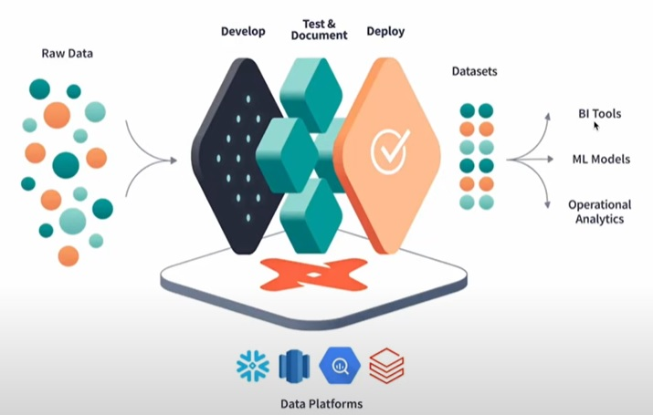
<br><br>

### Modular data modelling

To get started, we're going to use a modular data modeling approach. As we discussed in earlier lessons, we'll create fact tables and dimensional tables. The structure of our DBT project will look something like this:

- First, we have the tables we loaded (trips data). These are our sources.

- Then, we'll start building SQL scripts called "models" in DBT to perform transformations.

For example, we'll pick up the source data, clean it, deduplicate it, recast and rename columns, and typecast data. Afterward, we'll apply business logic to create fact and dimension tables. Finally, we'll create data marts to aggregate the data for our stakeholders.

We initially have tables that already exist outside our DBT project. These contain the data we will use, and we define them as sources. Additionally, we will use a file (e.g., taxi_zone_lookup) to create a table that will be incorporated into our transformations.

 <br>

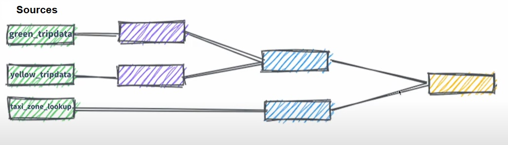
<br><br>

### Anatomy of a dbt model

How does this look in each SQL file? Let's examine the anatomy of a DBT model:

 <br>

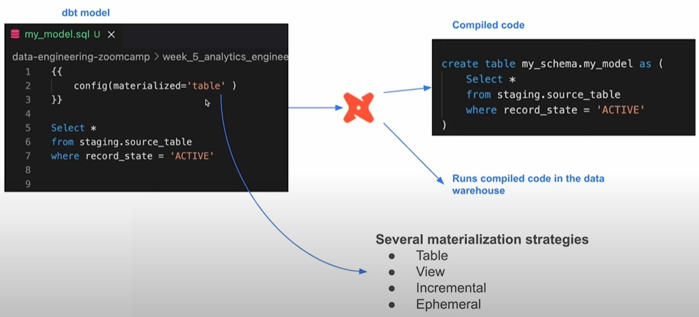
<br><br>

DBT models are SQL scripts. We'll always work with files named after the model, saved as .sql. Inside these files, we write SQL statements, primarily SELECT statements, because DBT handles the DDL (Data Definition Language) and DML (Data Manipulation Language) for us.

To tell DBT how to create the DDL and DML, we use configurations like this:

 <br>

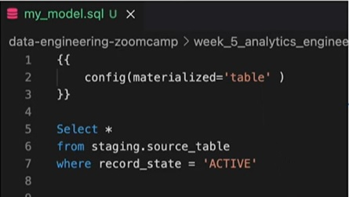
<br><br>

This tells DBT to materialize the model as a table in the database. When you run dbt run, it compiles all the SQL files in your project. For example, the result might look like this:

 <br>

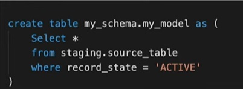
<br><br>

### Materializations in dbt cloud

There are mainly four types of materializations in DBT:

- Ephemeral: These are models that do not materialize in physical storage. They only exist within other models, similar to a Common Table Expression (CTE) if you're familiar with writing SQL.

- View: A view materializes in the database as a view. Every time you run dbt run, it creates or alters the view based on the SELECT statement in your file.

- Table: This materializes as a table in the physical database. Each time you run the model, DBT drops the existing table and recreates it with the CREATE TABLE AS SELECT statement, as shown earlier.

- Incremental: This is a more advanced materialization type. It also materializes as a table in the physical database, but instead of recreating the table entirely, it can work in two ways: Drop the table and recreate it with the SELECT statement or Insert only the new data into the table, allowing you to update the table incrementally.

### FROM clause of a dbt model

**1: sources**

We first select data from sources. This is the data we have already loaded, and we define it in a YAML file. In this file, we specify where to find the source, allowing us to define the data location only once. After that, we can reference all tables within that location using the definition.

This approach abstracts the complexity of where the source is physically stored, as we only define it once. When referencing it in the project, we use the source() function, providing the source name and the table name. DBT then compiles this reference into the appropriate database and schema location defined in the YAML file.

 <br>

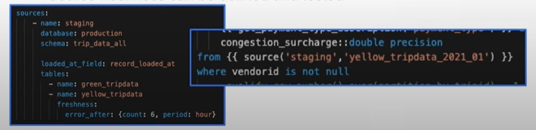
<br><br>

Another benefit of defining sources in DBT is the ability to perform extensive testing on them. A key example is freshness testing. We can define a threshold for the freshness of our data, which is particularly useful in production pipelines. This helps identify outdated data before stakeholders notice it. The freshness threshold ensures we’re alerted if the data exceeds the defined acceptable age.

Additionally, we can use selection to run specific DBT models dependent on fresh data. Testing and validation of sources significantly improve data quality in our models, as we verify the integrity of the input data.

**2: seeds**

The second source of data we select from is **seeds**. Seeds are CSV files stored within our repository. When running dbt run on a seed, DBT executes an operation similar to a COPY INTO command in SQL.

The advantage of using seeds in DBT is that they are version-controlled and stored in the same repository as the rest of the DBT project. This ensures:

- Consistency and centralization of all project files.
- Integration with version control for better collaboration.
- Documentation and testing capabilities for the seed data.

Seeds are ideal for data that does not change frequently. For example, we can use a seed for a master data table, like taxi_zone_lookup, which is relatively small and benefits from version control.

**3: refs**

The other thing we can select from, continuing with the modular approach, is the DBT models themselves. For example, after working with sources and creating transformations to clean the green trip data and yellow trip data, we can move on to building fact or dimensional models.

 <br>

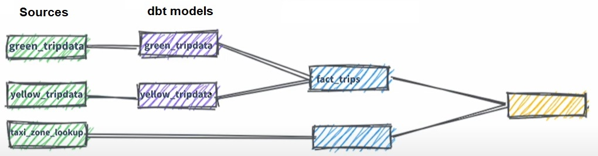
<br><br>

In these cases, we use the ref() function to reference the underlying tables. By specifying the name of the model within the ref() function, DBT compiles the code and determines the correct location for the referenced model.

This approach allows us to run the same code in any environment. For instance, when working locally, the model may go to a development schema like my_name_schema. In production, the same code will automatically point to a production schema. DBT abstracts the complexity of environment-specific configurations, enabling seamless execution across different environments.

Another benefit of using ref() is that it automatically builds dependencies between models. For example, if a new DBT model depends on the stg_green_tripdata model, DBT recognizes this relationship. This ensures that models are executed in the correct order during development and deployment, simplifying the process significantly.

 <br>

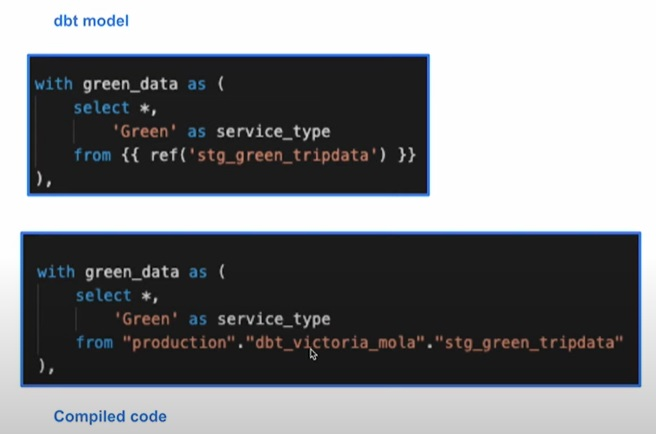
<br><br>

## 4.3.1.2 (Coding) Developing the staging models

Now that we have completely set up our DBT, we will `initialise` our DBT project. We will get loads of boilerplate templates as the image below - 

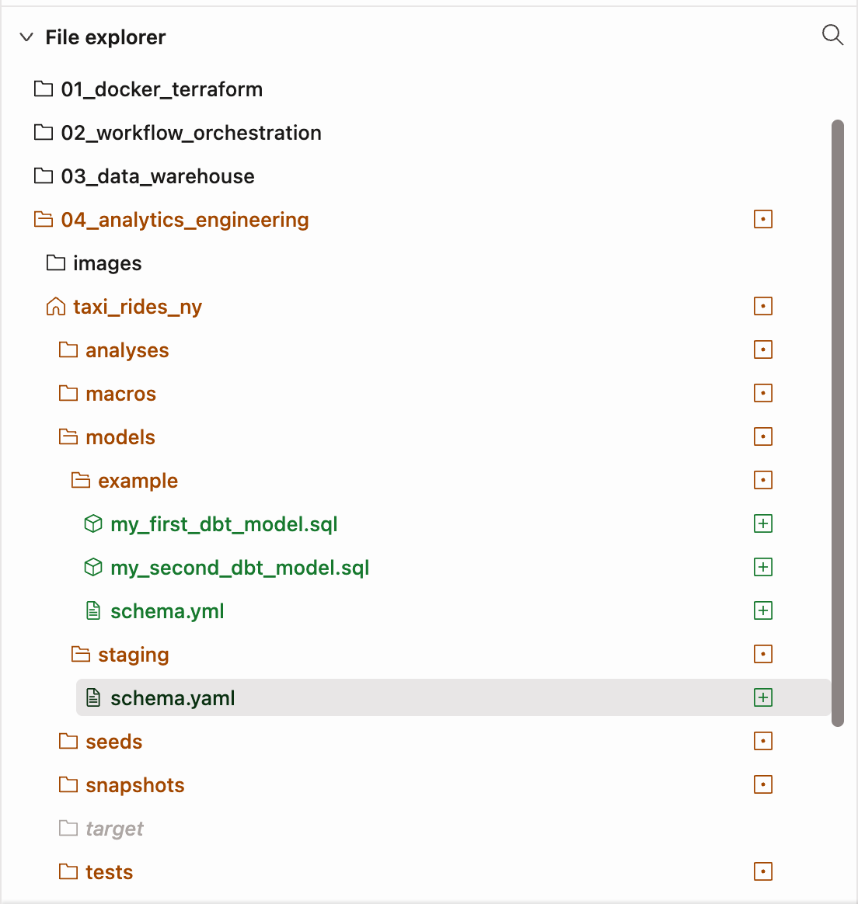

### schema.yml

Under the models directory, there is a folder named staging. This will represent the initial layer of models responsible for cleaning the source data. Inside the staging folder, there is a schema.yml file for defining the sources:

```yaml

version: 2

sources:
  - name: staging
    database: <database name from BigQuery> 
    schema: <schema in bigquery
      
    tables:
      - name: green_tripdata
      - name: yellow_tripdata

models:
    - name: stg_green_tripdata
    ...  
    - name: stg_yellow_tripdata
    ...
```

> [!NOTE]  
> Make sure the values ​​in the YAML match the values ​​in your BigQuery!

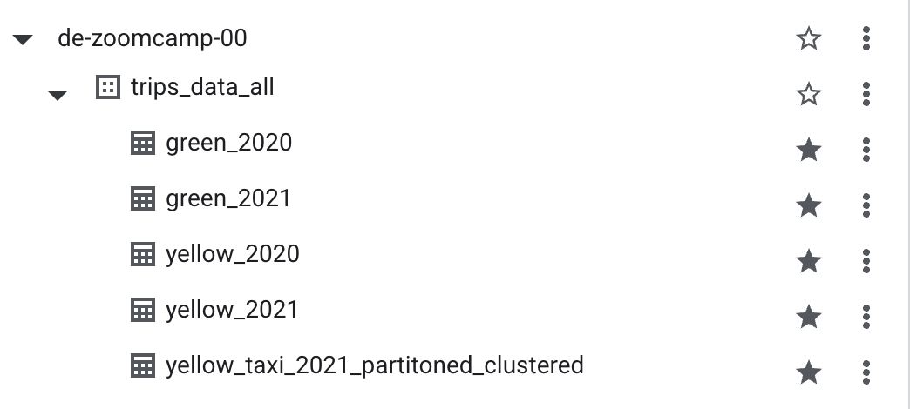

Since I had green and yellow trip data by year, I had to run an `UNION ALL` query to simplify my DBT models. Now I have `green_all` and `yellow_all`


### stg_green_tripdata.sql

Inside the staging folder, there is a stg_green_tripdata.sql file. This dbt model defines a SQL query that transforms and materializes data from a source table (green_tripdata) into a view in the database.

1) Sets the model to be materialized as a view. 

A view is a virtual table created dynamically by running the query each time it is accessed, rather than persisting data as a physical table.

```sql
{{
    config(
        materialized='view'
    )
}}
```
<br><br>

2) Deduplication and filtering

    * Data Source: Fetches data from the green_tripdata table in the staging schema using the {{ source() }} function, which references an external table defined in dbt's sources.

    * Filtering: Excludes rows where vendorid is NULL.

    * Deduplication: Uses the row_number() function to assign a unique row number (rn) within each group of records partitioned by vendorid and lpep_pickup_datetime. This helps to remove duplicates later.

    The main SELECT statement transforms the cleaned data (tripdata) into a more structured and enriched dataset.
    
    Last filtering ensures only the first record for each vendorid and lpep_pickup_datetime combination is included by filtering for rows where rn = 1.

```sql

with tripdata as 
(
  select *,
    row_number() over(partition by vendorid, lpep_pickup_datetime) as rn
  from {{ source('staging','green_tripdata') }}
  where vendorid is not null 
)

....
....
....

sql

from tripdata
where rn = 1
```
<br><br>

3) Using DBT utils function

    * Generates a unique surrogate key (tripid) by combining vendorid and lpep_pickup_datetime using dbt's generate_surrogate_key utility.

    * Safely casts vendorid to an integer using dbt's safe_cast() function.


```sql
{{ dbt_utils.generate_surrogate_key(['vendorid', 'lpep_pickup_datetime']) }} as tripid,
{{ dbt.safe_cast("vendorid", api.Column.translate_type("integer")) }} as vendorid,

```
<br><br>

4) Type casting

Converts datetime fields (lpep_pickup_datetime, lpep_dropoff_datetime) to timestamp format for consistent handling.

```sql

cast(lpep_pickup_datetime as timestamp) as pickup_datetime,
cast(lpep_dropoff_datetime as timestamp) as dropoff_datetime,

```
<br><br>

5) Type casting with dbt utils

Casts fields like passenger_count and trip_distance to appropriate types (integer and numeric).

```sql

{{ dbt.safe_cast("passenger_count", api.Column.translate_type("integer")) }} as passenger_count,
cast(trip_distance as numeric) as trip_distance,
```
<br><br>

6) Macros / Custom function

    * Handles financial data like fare_amount and tip_amount, casting them to numeric

    * Uses coalesce() to ensure payment_type is never NULL, defaulting to 0

    * Maps payment_type to a human-readable description using a custom function (get_payment_type_description).

```sql

cast(fare_amount as numeric) as fare_amount,
coalesce({{ dbt.safe_cast("payment_type", api.Column.translate_type("integer")) }},0) as payment_type,
{{ get_payment_type_description("payment_type") }} as payment_type_description

```
<br><br>

#### Why is a staging table required?

- Pulls directly from raw data sources (like `green_all` and `yellow_all` tables)
- Renames columns to consistent, snake_case formats
- Applies basic type casting (like converting strings to timestamps)
- Removes unwanted columns
- Adds useful metadata like ingestion date


### Macros

You may have noticed that I've been using elements enclosed in double curly brackets, such as {{ source() }} and {{ ref() }}. These are macros, and they allow us to dynamically generate SQL code. In DBT, the content inside double curly brackets is written in a templating language called Jinja. This language is similar to Python in its structure and enables us to define how DBT should compile the code.

Macros in DBT are essentially functions that generate code. Unlike functions in Python, the input and output of a macro result in dynamically generated SQL code. Macros are very useful for simplifying repetitive code, adhering to the DRY (Don't Repeat Yourself) principle, and enabling dynamic code generation. For example, you can use loops within a macro to generate complex SQL constructs like case statements.

Let’s create a macro called get_payment_type_description. It will take a parameter, such as payment_type, and generate a SQL case statement. The syntax for defining macros is similar to Python functions:

- Use macro to define the macro.
- Provide the macro's name.
- Specify its parameters.
- Include the SQL code to be dynamically generated


Here’s an example of get_payment_type_description.sql macro:

```sql

{#
    This macro returns the description of the payment_type 
#}



    case {{ dbt.safe_cast("payment_type", api.Column.translate_type("integer")) }}  
        when 1 then 'Credit card'
        when 2 then 'Cash'
        when 3 then 'No charge'
        when 4 then 'Dispute'
        when 5 then 'Unknown'
        when 6 then 'Voided trip'
        else 'EMPTY'
    end


```

This macro is designed to return the description of a given payment_type in a SQL context. It uses a CASE statement to map integer values of payment_type to their corresponding descriptions. 

- The macro uses dbt.safe_cast to ensure payment_type is safely converted to an integer (or a compatible type). This is useful for ensuring type compatibility in SQL.

- api.Column.translate_type("integer") helps translate the type definition for the database being used.

The macro outputs the resulting SQL CASE statement, which can then be embedded in a query to dynamically resolve the description of the payment type.

Example Usage:

 <br>

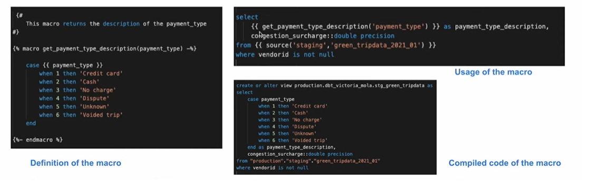
<br><br>


We can observe the macro in the stg_green_tripdata.sql file, line 42:

```sql

{{ get_payment_type_description("payment_type") }} as payment_type_description

```

The output of the macro is included in the query as a new column named payment_type_description. For instance:

 <br>

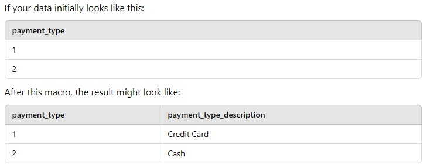
<br><br>


When compiled, DBT will replace the macro call with the actual SQL case statement. This approach saves time and effort when dealing with large-scale projects.

Macros can also be reused across projects by creating packages. A DBT package is similar to a library in other programming languages. It can contain models, macros, and other reusable components. By adding a package to your project, you can leverage its functionality anywhere in your codebase.

For example, if you find yourself frequently using a macro like get_payment_type_description across multiple projects, you can bundle it into a package and include it in your DBT projects using the packages.yml file.

## 4.3.1.3 (Coding) Developing the Core models

So far, our project looks like this: we have our two sources and a set of models. Now, we need to create our fact and dimensional tables

 <br>

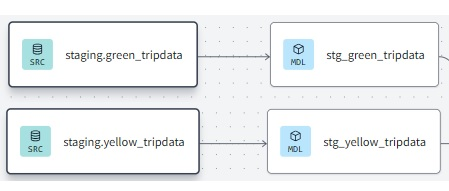
<br><br>

### Master Data Table - Dim zones

The goal for dim_zones is to act as a master data table containing all the zone information where the taxis operate. These taxis move within specific zones, and we want to ensure we have accurate information about them.

Since we don’t have source data for this, we’ll use the seeds mentioned earlier. For this, we'll leverage the taxi_zone_lookup file. It’s unlikely that this data will change frequently.

We’ll copy this data, save it as a CSV file, and include it in our project under the seeds folder. The file is named taxi_zone_lookup.csv, and it can be downloaded directly from GitHub if needed. Once saved, the seed file will have a distinct icon in the project, and we can preview the data.

The seed contains fields like location_id, which is also present in both the green and yellow trip data. This will allow us to connect the data with the taxi_zone_lookup table for additional context. The dim_zones model is under the core folder.

dim_zones.sql looks like this:

```sql

{{ config(materialized='table') }}

select 
    locationid, 
    borough, 
    zone, 
    replace(service_zone,'Boro','Green') as service_zone 
from {{ ref('taxi_zone_lookup') }}
```

The dim_zones model will use data from taxi_zone_lookup. It will define fields like location, borough, and service_zone. Additionally, we’ll address an issue where all entries labeled as "Borough" were actually "Green Zones," which only green taxis operate in. We'll clean up the data by renaming those values for easier analytics.

So far, our project looks like this:

 <br>

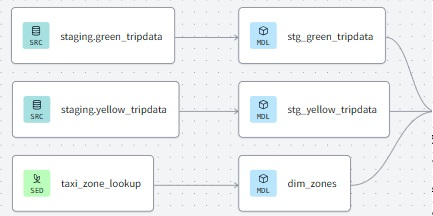
<br><br>

### Fact trips

With dim_zones, we are ready to create the next step: a fact table for trips (fact_trips). We will combine the green and yellow trip data, encase it with dimensional data, and materialize it as a table. Materializing it as a table ensures better performance for analytics since this table will be large due to unions and joins.

fact_trips.sql model goal is to:

- Combine both green and yellow trip data.
- Add a field to identify whether a record is from the green or yellow dataset for easier analysis.
- Join this data with the dim_zones model to enrich it with pickup and drop-off zone details.


fact_trips.sql looks like:

```sql

{{
    config(
        materialized='table'
    )
}}

with green_tripdata as (
    select *, 
        'Green' as service_type
    from {{ ref('stg_green_tripdata') }}
), 
yellow_tripdata as (
    select *, 
        'Yellow' as service_type
    from {{ ref('stg_yellow_tripdata') }}
), 
trips_unioned as (
    select * from green_tripdata
    union all 
    select * from yellow_tripdata
), 
dim_zones as (
    select * from {{ ref('dim_zones') }}
    where borough != 'Unknown'
)
select trips_unioned.tripid, 
    trips_unioned.vendorid, 
    trips_unioned.service_type,
    trips_unioned.ratecodeid, 
    trips_unioned.pickup_locationid, 
    pickup_zone.borough as pickup_borough, 
    pickup_zone.zone as pickup_zone, 
    trips_unioned.dropoff_locationid,
    dropoff_zone.borough as dropoff_borough, 
    dropoff_zone.zone as dropoff_zone,  
    trips_unioned.pickup_datetime, 
    trips_unioned.dropoff_datetime, 
    trips_unioned.store_and_fwd_flag, 
    trips_unioned.passenger_count, 
    trips_unioned.trip_distance, 
    trips_unioned.trip_type, 
    trips_unioned.fare_amount, 
    trips_unioned.extra, 
    trips_unioned.mta_tax, 
    trips_unioned.tip_amount, 
    trips_unioned.tolls_amount, 
    trips_unioned.ehail_fee, 
    trips_unioned.improvement_surcharge, 
    trips_unioned.total_amount, 
    trips_unioned.payment_type, 
    trips_unioned.payment_type_description
from trips_unioned
inner join dim_zones as pickup_zone
on trips_unioned.pickup_locationid = pickup_zone.locationid
inner join dim_zones as dropoff_zone
on trips_unioned.dropoff_locationid = dropoff_zone.locationid
```

- Select all fields from both the green and yellow trip data using ref() for references and add a service_type column to distinguish the datasets.

- Union the data to create a combined dataset (trips_union).

- Join trips_union with dim_zones for both pickup and drop-off zones to associate zone names and other details. Only valid zones will be included (e.g., exclude unknown zones).

When we run the model with the full production dataset, the resulting table will contain millions of rows, representing a comprehensive and enriched fact table. This table is now ready for use in analysis or as a source for BI tools.

With all of this, the fact_trips table is complete, and we can proceed to testing and further analysis.

So far, our project looks like this:

 <br>

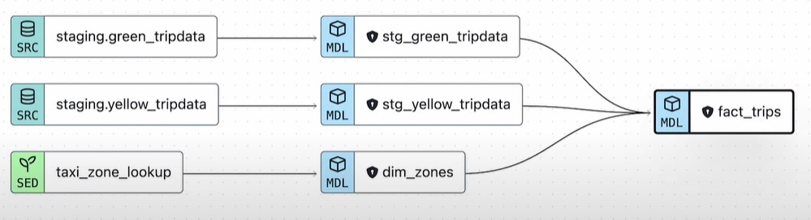
<br><br>

We can check the lineage to see how the modular data modeling looks. Now, we can observe that fact_trips depends
on all the required models. One of the great features of dbt is that it identifies all these connections. This
means we can run fact_trips, but first, dbt will execute all its parent models. dbt will test the sources for 
freshness or other requirements, run any missing or outdated models, and only then build fact_trips.

Since this project contains 2020 and 2021 (July) data we have 26550557 rows of data in our final fact trips


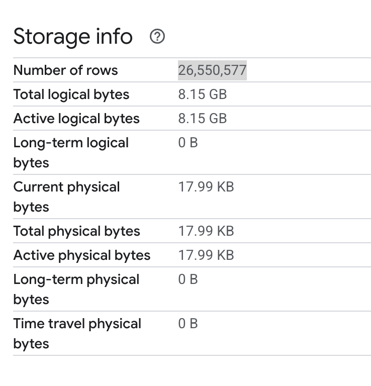

### Monthly zone revenue

This is a dbt model that creates a table summarizing revenue-related metrics for trips data as a table selecting data from our previous dbt model called fact_trips.

This model creates a table with monthly revenue metrics per pickup zone and service type, including various fare components, trip counts, and averages.

It enables analysis of revenue trends, passenger patterns, and trip details across zones and services, giving a clear breakdown of monthly performance.

dm_monthly_zone_revenue.sql looks like:

```sql

{{ config(materialized='table') }}

with trips_data as (
    select * from {{ ref('facts_trips') }}
)
    select 
    -- Reveneue grouping 
    pickup_zone as revenue_zone,
    {{ dbt.date_trunc("month", "pickup_datetime") }} as revenue_month, 

    service_type, 

    -- Revenue calculation 
    sum(fare_amount) as revenue_monthly_fare,
    sum(extra) as revenue_monthly_extra,
    sum(mta_tax) as revenue_monthly_mta_tax,
    sum(tip_amount) as revenue_monthly_tip_amount,
    sum(tolls_amount) as revenue_monthly_tolls_amount,
    sum(ehail_fee) as revenue_monthly_ehail_fee,
    sum(improvement_surcharge) as revenue_monthly_improvement_surcharge,
    sum(total_amount) as revenue_monthly_total_amount,

    -- Additional calculations
    count(tripid) as total_monthly_trips,
    avg(passenger_count) as avg_monthly_passenger_count,
    avg(trip_distance) as avg_monthly_trip_distance

    from trips_data
    group by 1,2,3
```    

The main query groups the data by:

- Pickup zone (pickup_zone) → Labeled as revenue_zone.
- Month of the pickup date (pickup_datetime) → Labeled as revenue_month 
- Service type (service_type) → Such as economy, premium, etc.

For each group, the query calculates revenue-related metrics like revenue_monthly_fare (Sum of fare_amount), revenue_monthly_extra (Sum of additional fees), etc and other metrics like total_monthly_trips (Count of trips), avg_monthly_passenger_count (Average number of passengers per trip) and avg_monthly_trip_distance (Average distance per trip).

Finally, The GROUP BY 1, 2, 3 clause organizes the results by the specified dimensions (pickup zone, revenue month, and service type). Each calculation is applied within these groups. 1 refers to pickup_zone, 2 refers to the truncated month of pickup_datetime, 3 refers to service_type.

So far, our project looks like this:

 <br>

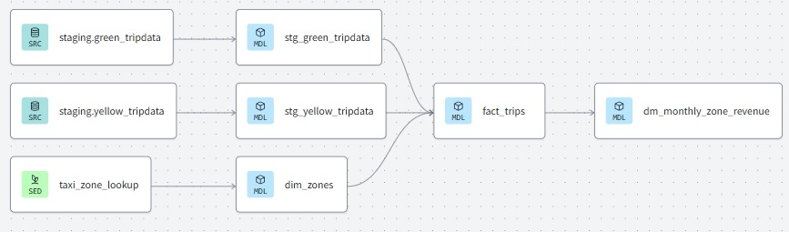
<br><br>

### Development Overview

**1: schema.yml values**

**2: Check BigQuery**

Head over to BigQuery and check the views that dbt generated:

 <br>

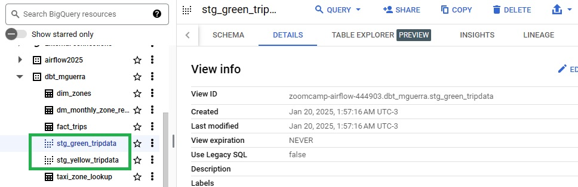
<br><br>

 <br>

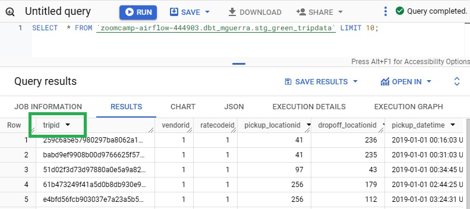
<br><br>

 <br>

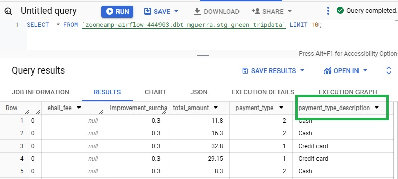
<br><br>

Dim_zones:

 <br>

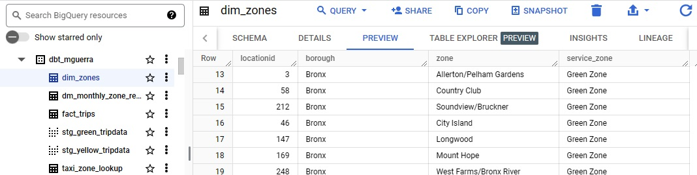
<br><br>

Fact_trips:

 <br>

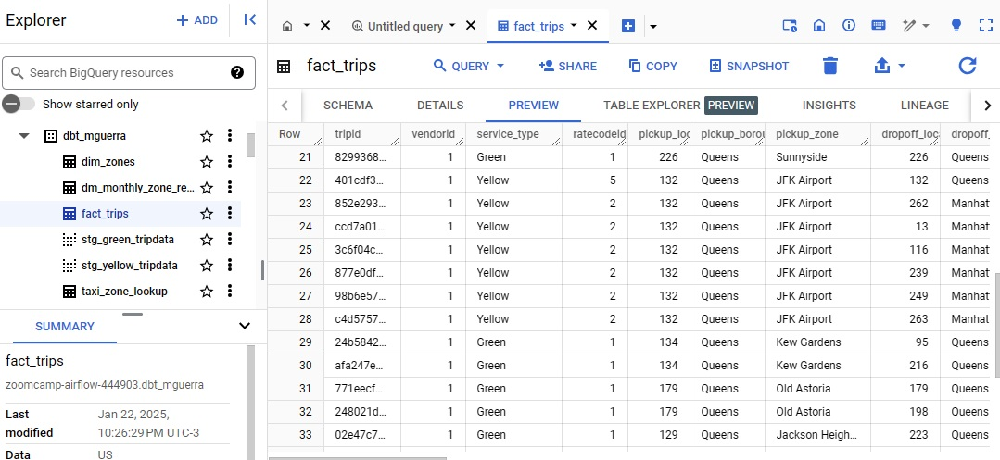
<br><br>

dm_monthly_zone_revenue:

 <br>

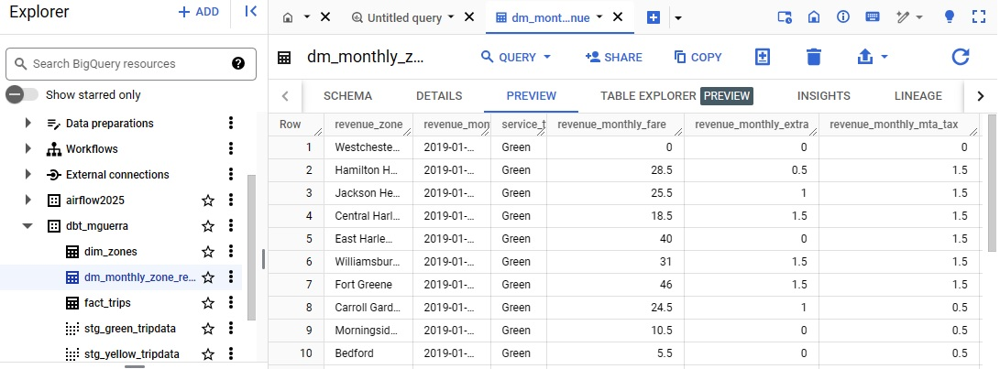
<br><br>


## 4.3.2 Test and Document the project

### Theory Testing

We have many models now, but how do we ensure that the data we deliver to the end user is correct? More importantly, how do we make sure that we don't build models on top of incorrect data? We need to identify errors quickly. For this reason, we can use DBT tests.

DBT tests are assumptions we make about our data. They're essentially statements that select data we don’t want to have. If the query produces results, the test fails and stops execution immediately, preventing the building of dependent models. For example, when building a project, if the query returns no results, the test passes, the data is good, and no alerts are triggered.

These assumptions are primarily defined in YAML files like our schema.yml and are compiled into SQL code. DBT comes with four out-of-the-box tests:

- Unique Test - Ensures the uniqueness of a field in the data model.
- Not Null Test - Verifies that a field does not contain null values.
- Accepted Values Test - Checks if a field contains only predefined valid values.
- Foreign Key Test - Ensures relationships between fields in different tables are valid.

For example, the "Accepted Values" test might ensure that a field like payment_type only contains values 1, 2, 3, 4, or 5. If it’s outside this range, the test will fail:

```yaml

          - name: payment_type
            description: A numeric code signifying how the passenger paid for the trip.
            tests:
              - accepted_values:
                  values: [1,2,3,4,5]
                  severity: warn

```            


Another test ensures that pickup_location has a valid relationship to the ref_taxi_lookup table, verifying it corresponds to a valid taxi zone:

```yaml

          - name: Pickup_locationid
            description: locationid where the meter was engaged.
            tests:
              - relationships:
                  to: ref('taxi_zone_lookup')
                  field: locationid
                  severity: warn
```                  

Similarly, trip_id must be unique and not null, as it’s the primary key:

```yaml

          - name: tripid
            description: Primary key for this table, generated with a concatenation of vendorid+pickup_datetime
            tests:
                - unique:
                    severity: warn
                - not_null:
                    severity: warn
```                    

When these tests are compiled, they generate SQL code like this:

 <br>

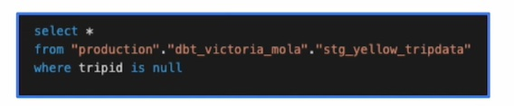
<br><br>


If there are no results, the data is valid. Otherwise, it will produce warnings, helping us identify and fix issues in our data quickly:

 <br>


<br><br>

### Adding models and writing tests

Now that we have many models we are required to know some information about each of these models. Dbt has a macros that we can use to generate the models. 

Although `schema.yaml` has a 'generate model' it doesn't seem to work. Hence we are using the below macro to help us with it - 

_[generate_model_yaml](https://github.com/dbt-labs/dbt-codegen/tree/0.13.1/?tab=readme-ov-file#generate_model_yaml-source)_

```

{{ codegen.generate_model_yaml(
    model_names = models_to_generate
) }}
```

Create a new file and we can use the above script to compile the code to generate our models. These models can then be pasted into our `schema.yml`

<br>
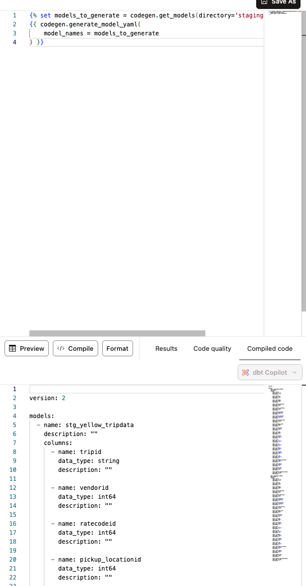
<br><br>

We can now add our tests to our models generated.  

## Deployment

We now have our whole project, so it's time to take it into production, analyze the data, and serve it to our 
stakeholders. If we recall what we learned about dbt at the very beginning, we introduced layers to our 
development. We’ve already seen how to handle development, testing, and documentation, all happening in our 
development environment.

Now, to take it into production, we go through a process called deployment. This involves taking all our code, 
opening a pull request, and merging the code into the main branch, which affects our production environment. 
In production, we’ll run the models, but there will be some differences.

For example, during development, we often limit the data. In production, we need all the data without limits. 
Additionally, in a real-life production scenario, not everyone will have the same access rights. Not everyone 
will be able to write or read all the data. This is likely handled in a different database or schema with 
specific access controls.

The deployment workflow works as follows:

- Development is done in custom branches. Each team member works in their own development branch.

- Meanwhile, production continues using the main branch, unaffected by the development branches.

- When a development branch is ready for production, a pull request is opened.

- Once approved, the code is merged into the main branch.

- Run the new models in the production environment using the main branch.

- Schedule the models updating on a nightly, daily or hourly basis to keep the data up to date.

## Runnable Commands

To build a test run as it's cheaper - 
```
dbt build --select stg_green_tripdata --vars '{'is_test_run': 'false'}'
```

To build a full run with all models - 
```
dbt build --vars '{"is_test_run": false}'
```

To test whole project -
```
dbt test
```

To test a specific model - 
```
dbt test --select stg_yellow_tripdata
```

To generate docs
```
dbt docs generate
```

## Dashboard 

Dashboard is created using Googles Looker studio or previously called Google Data Studio

Please view the dashboard using this [link](https://lookerstudio.google.com/reporting/0eec052a-af9b-43ed-95e8-09983c360cc8)
