# Analytics Engineering

## 4.1.1 Analytics Engineering Basics

In a traditional data team, we recognize the data engineer, the data analyst, and sometimes the data scientist. The data engineer prepares and maintains the infrastructure the data team needs. The data analyst uses the data hosted in that infrastructure to answer questions and solve problems.

With recent developments, data scientists and analysts are writing more code, but they are not trained as software engineers, and this is not their primary focus. Similarly, data engineers, while excellent software engineers, lack training in how the data is used by business users.

This gap is where the analytics engineer comes in. The role combines elements of the data engineer and the data analyst. It introduces good software engineering practices from the data engineer to the efforts of data analysts and scientists.

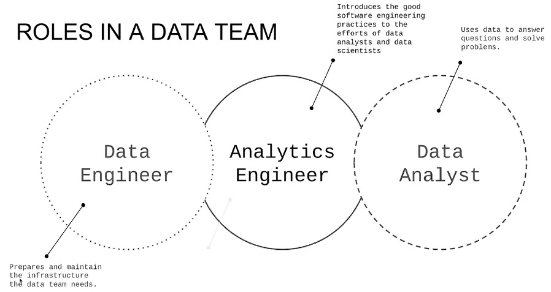

<br><br>

The analytics engineer may be exposed to the following tools:

- Data Loading (Stitch, Apache NiFi, Airbyte)
- Data Storing (Google BigQuery, Snowflake, Amazon Redshift)
- Data Modeling (dbt, Dataform, Apache Spark SQL)
- Data Presentation (Looker, Tableau, Google Data Studio, Power BI, Metabase)

This module, we’ll focus on the last two areas: data modeling and presentation

### Data Modelling Concepts

**ETL vs. ELT**

In ETL, we extract the sources, transform the data, and then load it into a data warehouse. In ELT, we load the data into the data warehouse first and then transform it.

The first approach takes longer to implement because we must transform the data upfront. However, this results in more stable and compliant data because it is clean. On the other hand, ELT is faster and more flexible because the data is already loaded.

This approach leverages cloud data warehousing, which has lowered the cost of storage and compute. Without those restrictions, we can afford to load all our data first and transform it within the data warehouse.

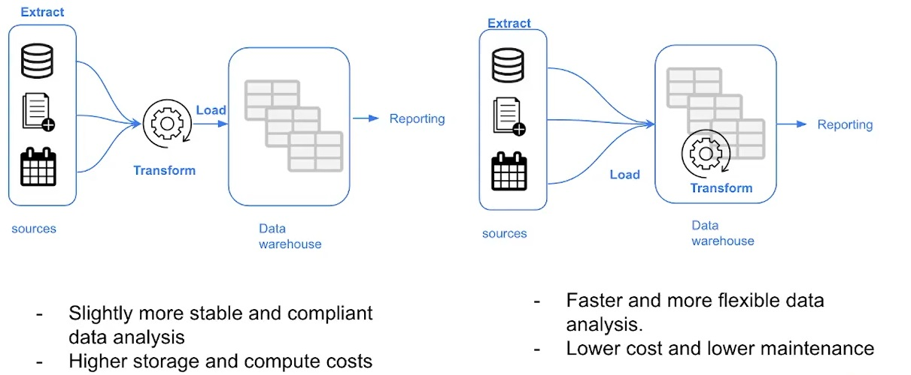

<br><br>

We will now dive deeper into the transformation step.

**Kimball's Dimensional Modeling**

Kimball's Dimensional Modeling is a methodology for designing data warehouses. It was introduced by Ralph Kimball
and is an approach to Data Warehouse design which focuses on 2 main points:

- Deliver data that is understandable to the business
- Deliver fast query performance

Other goals such as reducing redundant data (prioritized by other approaches) are secondary. We are not going to
focus heavily on making sure that data is not redundant; instead, we prioritize user understandability of this
data and query performance.

Kimball's Dimensional Modeling uses Star Schema Design as its primary approach for organizing data in a data 
warehouse. This design ensures the data is easy to query, supports high performance, and aligns with the analytical
needs of businesses.

**Elements of Dimensional Modeling**

We are going to be talking mainly about two types of tables. Fact tables and dimensional tables. This is also 
known as the star schema.

- Fact tables: The central table in the schema. Contains quantitative data, metrics, or measurements that 
represent business processes (e.g., sales, revenue, or inventory counts). Includes foreign keys that link to the dimension tables.

- Dimensions tables: provide context to these fact tables. Contain attributes (details) about dimensions such as 
time, product, customer, or location.

The star schema is a type of database schema that is widely used in data warehousing and business intelligence 
for organizing and querying data. It is called "star schema" because its structure resembles a star shape when 
visualized: a central fact table is surrounded by multiple dimension tables.

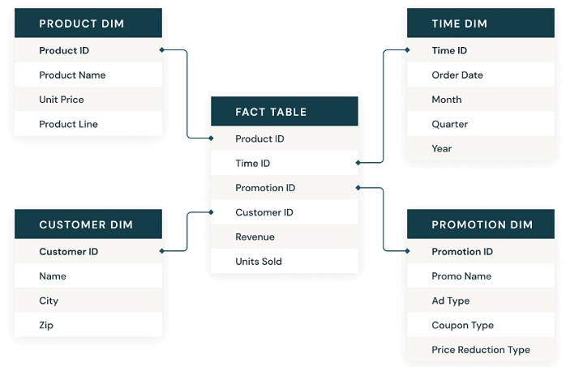

<br><br>

The star schema simplifies data organization for analytics and reporting while prioritizing performance and ease
of use over strict normalization. Dimension tables can store repeated data, which consumes more storage compared
to normalized schemas.

**Architecture of Dimensional Modeling**

An analogy that is presented in Kimball's dimensional modeling is the kitchen analogy. The book compares
how the data warehouse and the ETL process could be compared with a restaurant:

- Staging Area: Here, we have the raw data. This is not meant to be exposed to everyone but only to those who 
 know how to use that raw data. In the case of a restaurant, this would be the food in its raw state before being 
 processed.

- Processing Area: This is the kitchen in a restaurant. Here, raw data is processed and turned into data models.
 Again, this is limited to those who know how to do this, such as the cooks. The focus is on efficiency and 
 ensuring standards are followed.

- Presentation Area: This is the dining hall and represents the final presentation of the data. Here, the data 
 is exposed to business stakeholders.

 ## 4.1.2 Introduction to DBT

 **What is dbt?** 

dbt is a transformation workflow that allows us to use SQL, or Python as well, to deploy analytical code. This code enables us to process all the data loaded from different sources. For example, in our case, we're using taxi data, but in a company setting, as a data engineer, you might work with data from backend systems, apps, frontend systems, or even third-party providers.

All this data is loaded into a data warehouse. We're referencing BigQuery, but it could also be other platforms. dbt sits on top of the data warehouse and helps transform raw data into something meaningful and useful for the business or stakeholders. This transformed data could be consumed by BI tools or integrated into other workflows, such as machine learning pipelines.

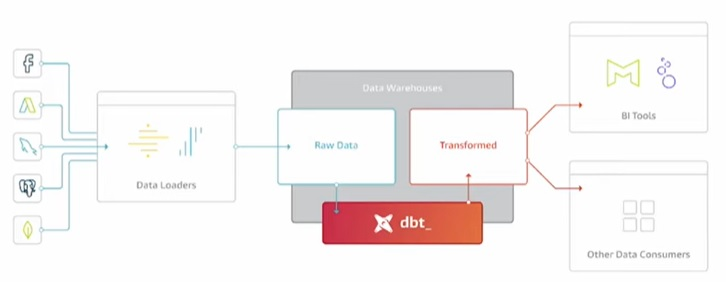

<br><br>

dbt helps turn raw data into actionable data by applying data modeling techniques. Additionally, it incorporates software engineering practices, like version control and modularity, into the analytics workflow. dbt allows developers to write SQL or Python in a sandboxed environment, introducing layers like testing, documentation, and CI/CD pipelines.

**How does dbt work?**

In dbt, a model is essentially a SQL file where you write the logic to transform your data. For instance, if you have raw data in your data warehouse, you can create a model to apply transformations, clean it, and make it more structured and useful for analysis. A dbt model typically contains a SQL statement, such as a SELECT query, that defines how the data should be transformed.

A dbt model looks like this:

```sql
WITH
    orders as (select * from {{ref('orders')}}),
    line_items as (select * from {{ref('line_items')}})

SELECT
    id,
    sum(line_items.purchase_price)    

FROM orders
LEFT JOIN line_items ON orders.id = line_items.order_id

GROUP BY 1;
```
dbt simplifies many of the complexities traditionally associated with data transformation. It abstracts away the details of where the transformed data will be stored (e.g., in which schema or environment in your data warehouse). It also automates the generation of necessary SQL commands, such as Data Definition Language (DDL) for creating tables or views and Data Manipulation Language (DML) for inserting or updating data. This means you don't need to manually write the boilerplate SQL to manage these aspects.

When you execute a dbt command, such as dbt run, the tool compiles all the SQL files in your project. During this process, it resolves references between models, applies configuration settings (like whether a model should be a table or a view), and optimizes the SQL queries. Then, it runs the compiled SQL against your data warehouse.

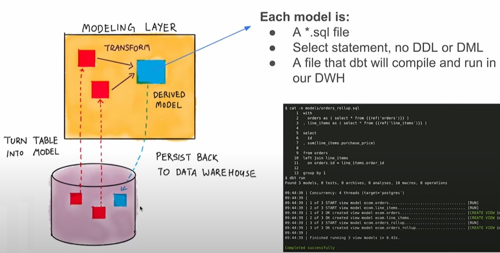

<br><br>

Here’s how it works step by step:

1. Selection of Raw Data: The SQL statement in your model pulls raw data from the source tables or external datasets in the data warehouse.

2. Transformation: The model applies transformations, such as filtering, aggregations, joins, or calculations, to clean and organize the raw data

3. Persistence: Once the data is transformed, dbt persists the results back into the data warehouse as a table or a view. A table is a physical dataset stored in the warehouse. A view is a virtual dataset that dynamically runs the transformation logic whenever queried.

**How to use dbt?**

dbt has 2 main components: dbt Core and dbt Cloud:

* ***dbt Core***: open-source project that allows the data transformation.
    * Builds and runs a dbt project (.sql and .yaml files).
    * Includes SQL compilation logic, macros and database adapters.
    * Includes a CLI interface to run dbt commands locally.
    * Open-source and free to use.

* ***dbt Cloud***: SaaS application to develop and manage dbt projects.
    * Web-based IDE to develop, run and test a dbt project.
    * Jobs orchestration.
    * Logging and alerting.
    * Intregrated documentation.
    * Free for individuals (one developer seat).


**How are we going to use dbt?**

There are two ways to use dbt, and throughout the project, you'll see videos illustrating these approaches: version A and version B.

- Version A primarily uses BigQuery as the data warehouse. This method involves using the dbt Cloud Developer plan, which is free. You can create an account at no cost, and since this is cloud-based, there’s no need to install dbtcore locally.

- Version B uses PostgreSQL. In this approach, you'll perform development using your own IDE, such as VS Code, and install dbt Core locally connecting to the postgresql database. You will be running  dbt models through the CLI

During the project you might already have data loaded into GCP buckets. This raw data will be loaded into tables in BigQuery. dbt will be used to transform the data, and finally, dashboards will be created to present the results.

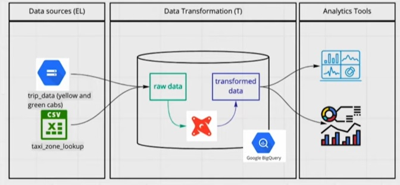

<br><br>

## 4.2.1 Starting DBT project using BigQuery

**1: Create a BigQuery service account**

In order to connect we need the service account JSON file generated from bigquery. Open the [BigQuery credential wizard](https://console.cloud.google.com/apis/credentials/wizard) to create a service account

Go to API and services > Credentials > + Create credentials > Help me choose

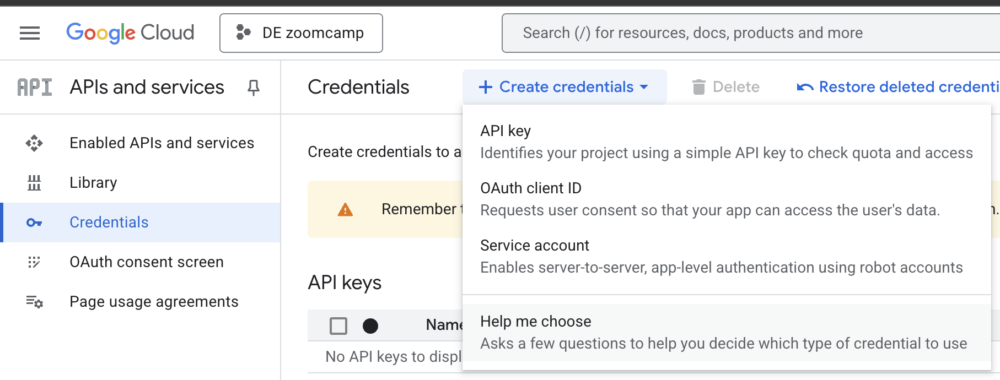

Select BigQuery API and Application data
<br>

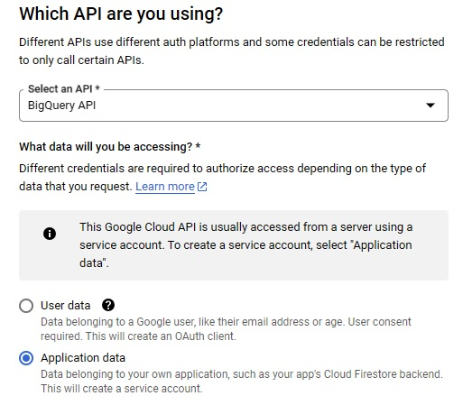
<br><br>

Next --> Continue --> Complete Service account name and description
<br>

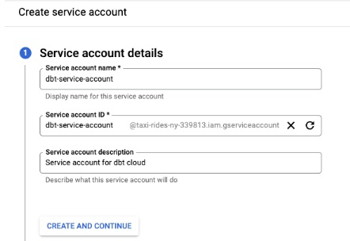
<br><br>

Click on Create and continue

Select role --> BigQuery Admin

You can either grant the specific roles the account will need or simply use BigQuery admin, as you'll be the sole user of both accounts and data.
<br>

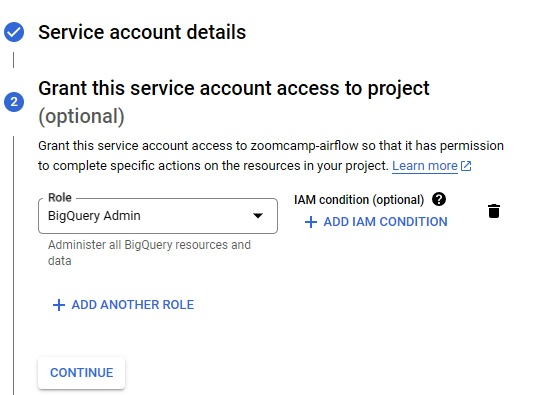
<br><br>

Click on continue --> Click on Done


**2: Download JSON key**

Now that the service account has been created we need to add and download a JSON key, go to the keys section, select "create new key". Select key type JSON and once you click on create it will get inmediately downloaded for you to use.

In the navigation menu (the three horizontal lines in the top-left corner), go to IAM & Admin > Service Accounts.

Find the dbt service account:
<br>

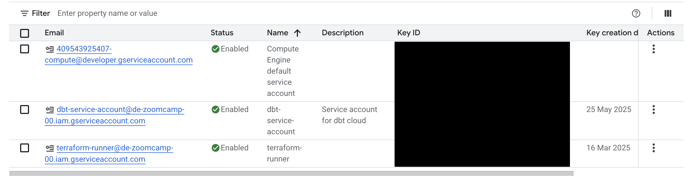
<br><br>

Navigate to the Keys tab. Click on Add Key > Create New Key
<br>

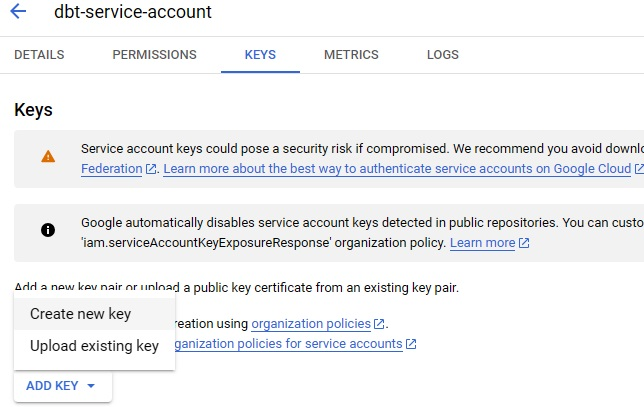
<br><br>

select JSON as the key type --> Create


**3: Copy taxi_rides_ny folder**

Copy taxi_rides_ny folder from https://github.com/DataTalksClub/data-engineering-zoomcamp/tree/main/04-analytics-engineering in your 04-analytics-engineering folder

This taxi_rides_ny folder contains macros, models, seeds. Cloning these elements gives you a strong foundation
for your DBT project, enabling you to focus on building and improving your data pipeline rather than starting
from scratch. Also saves time by reducing the need to recreate common logic or datasets.

```
git clone https://github.com/DataTalksClub/data-engineering-zoomcamp.git
```

Then copy the taxi_rides_ny folder in your own 04-analytics-engineering folder

**4: Create a dbt cloud project**

Create a dbt cloud account from [their website](https://www.getdbt.com/pricing/) (free for solo developers)
Once you have logged in into dbt cloud you will be prompt to create a new project.

You are going to need: 

 - access to your data warehouse (bigquery)
 - admin access to your repo, where you will have the dbt project.

 <br>

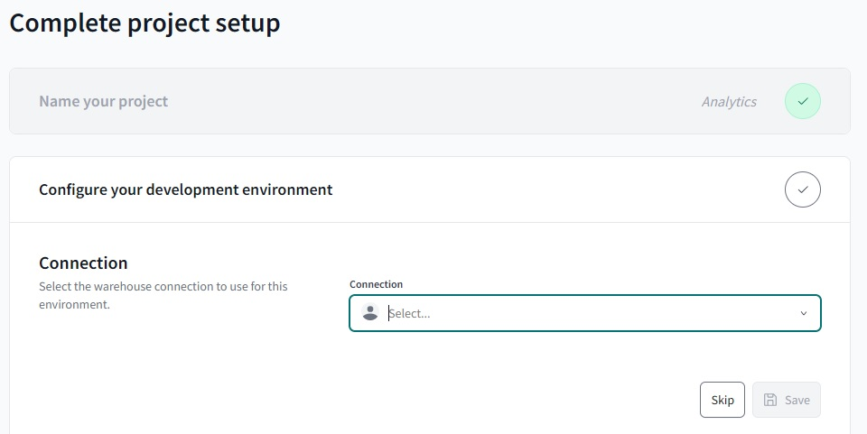
<br><br>

Add new connection --> Select BigQuery
 <br>

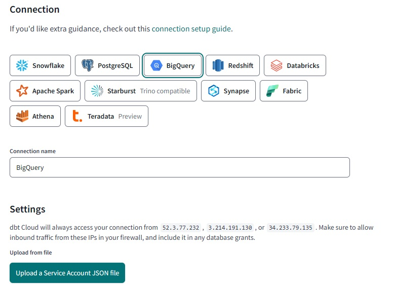
<br><br>

Click on Upload a Service Account JSON file --> upload the json from step 2

Click on Save

Back on your project setup, select BigQuery:

 <br>

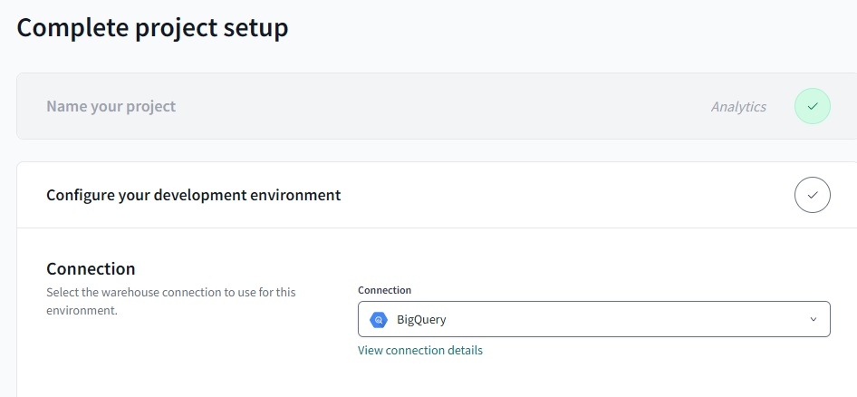
<br><br>

Click on save

Test the connection and click on save the Development credentials, not necessary to change those values:

 <br>

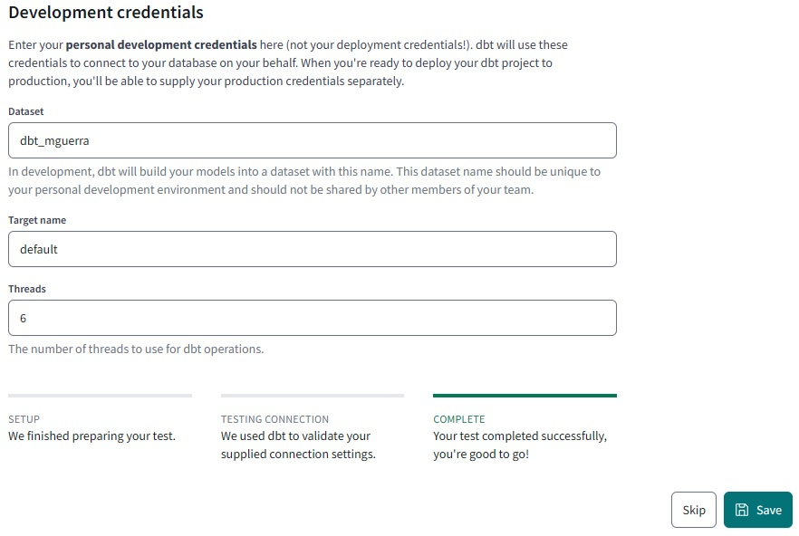
<br><br>


Now its time to setup a repository:
 <br>

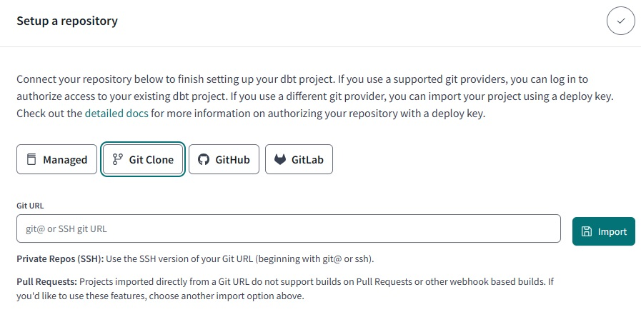
<br><br>

Select git clone and paste the SSH key from your repo:

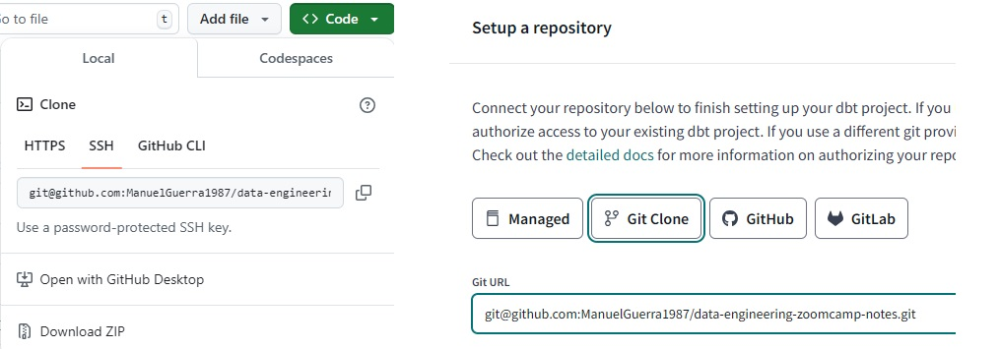
<br><br>

Click on import --> Click on next

You will get a deploy key:

 <br>

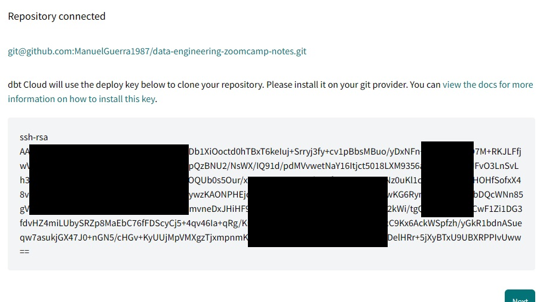
<br><br>

Head to your GH repo and go to the settings tab. You'll find the menu deploy keys. Click on add key and paste the deploy key provided by dbt cloud. Make sure to click on "write access":

 <br>

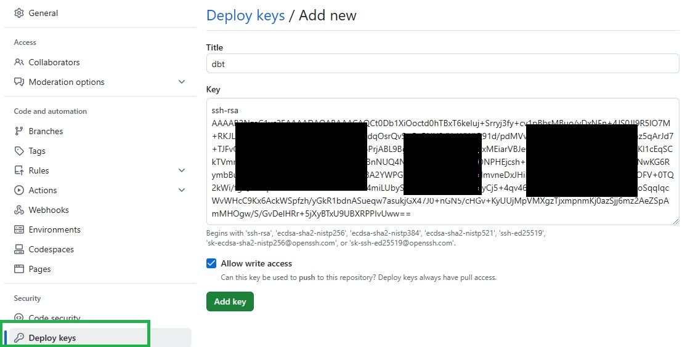
<br><br>

Back on dbt cloud, click on next, you should look this:


 <br>

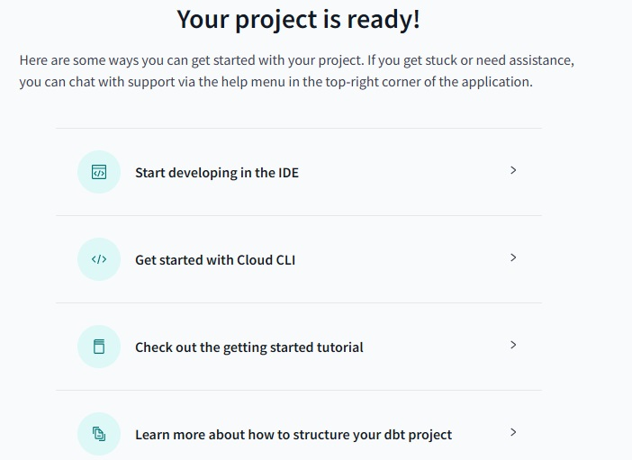
<br><br>


Also make sure you informed taxi_rides_ny as the project subdirectory:

On the left sidebar, click on dashboard --> settings --> Edit

 <br>

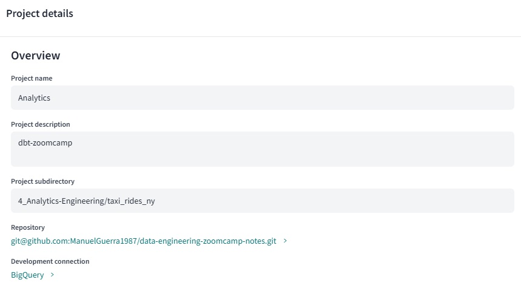
<br><br>

**5: Create new branch**

On the left sidebar, click on Develop --> Cloud IDE


Create a new branch:

 <br>

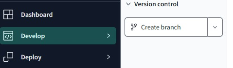
<br><br>

I will use "dbt" branch. After creating the new branch, you can go to your repo on github and see the new branch created.

Note: it is important to create a new branch, because if we had chosen to work on the master branch we would get stuck in read-only mode.

