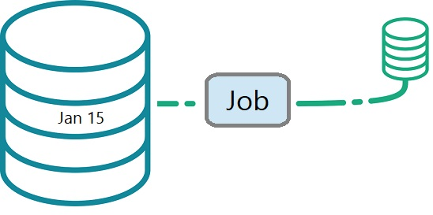
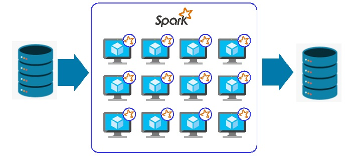

# Batch Processing

### Table of contents

- [5.1.1 Introduction to Batch Processing](#introduction-to-batch-processing)
- [5.1.2 Introduction to Spark](#introduction-to-spark)
- [5.2.1 Installation](#installation)
- [Spark SQL and DataFrames](#spark-sql-and-dataframes)
    - [First Look at PySpark](#first-look-at-pyspark)
    - [Spark DataFrames](#spark-dataframes)    
    - [Preparing Taxi Data](#preparing-taxi-data)  
    - [SQL with Spark](#sql-with-spark)  
- [Spark Internals](#spark-internals)    
    - [Anatomy of a Spark Cluster](#anatomy-of-a-spark-cluster)
    - [GroupBy in Spark](#groupby-in-spark)    
- [Running Spark in the Cloud](#running-spark-in-the-cloud)   
    - [Connecting to Google Cloud Storage](#connecting-to-google-cloud-storage)    
    - [Creating a Local Spark Cluster](#creating-a-local-spark-cluster)    
    - [Setting up a Dataproc Cluster](#setting-up-a-dataproc-cluster) 
    - [Connecting Spark to Big Query](#connecting-spark-to-big-query) 

## Introduction

In this week we will first talk about what batch processing is. One of the tools that we can use for batch processing is Spark, and we will spend most of the time this week talking about Spark.

We'll use PySpark for that, meaning we will use Python, not Scala. Then, we will look at different features of Spark like DataFrames, SQL, how we do joins in Spark, and then we will talk about a relatively old concept from Spark called RDDs (Resilient Distributed Datasets).

We will discuss what they are and the difference between DataFrames and RDDs. We will spend some time talking about internals and how we can use Docker to run Spark jobs. All that we will do locally, but then at the end, in the last two lessons, we will talk about deploying, actually going to the cloud, and running Spark jobs there, then connecting this to a data warehouse.

## Introduction to Batch Processing

_[Video source](https://www.youtube.com/watch?v=dcHe5Fl3MF8)_

**Batch vs Streaming**

There are multiple ways of processing data. One is called batch, and the other one is called streaming.

**Batch:**

Let's say you have a database, and this is our taxi trip dataset. We have some data for January 15, for example. Then we take all the data we have for January 15 and there is one single job that takes all this data for January 15 and then produces something else, some other dataset.

This particular job reads the data for the entire day from 00:00 January 15th to 23:59 January 15th, takes all the data, processes it, and does something.

 

  

**Streaming:**

Imagine a taxi service where every time a user requests a ride, trip information (location, estimated
 time of arrival, fare, etc.) is sent and processed in real time. Each event that is generated (ride 
 start, stops, arrival at the destination) is part of the data stream.

A data stream is a continuous sequence of data that is generated and processed in real time or near 
real time. Instead of waiting for large amounts of data to accumulate before processing them (as in 
batch processing), data streams allow information to be handled as it arrives. This week, we will not 
talk about this. This week, we will focus on things that process huge chunks of data in one go.

**Batch jobs**

Batch jobs typically run on a scheduled basis, processing accumulated data over a set period. The most 
common intervals are daily and hourly.

- Daily batch jobs collect data throughout the day and process it once the day is over.

- Hourly batch jobs process everything that happened in the previous hour.
- Less common intervals include running batch jobs multiple times per hour, such as every five minutes,
 but these are not as typical.

 **Technologies for Batch Jobs**

Batch jobs often use Python scripts to handle data ingestion and transformation. For example, a script 
might retrieve a CSV file and load it into a database. These scripts can run at various intervals, 
including monthly.

SQL is another common choice for defining transformations. In week four, we saw how SQL can process 
large chunks of data at once, making it well-suited for batch processing.

Apache Spark is a widely used technology for batch jobs, along with alternatives like Apache Flink.

**Execution and Orchestration**

Python scripts can run on various platforms, including Kubernetes and AWS Batch. To manage and 
orchestrate batch workflows, Airflow is commonly used.

A typical workflow might look like this:

- Data ingestion: CSV files are stored in a data lake.

- Python processing:  A script processes the CSVs and moves the data to a warehouse.

- SQL transformations: Using tools like dbt, the data is transformed.

- Further processing: Spark or additional Python jobs refine the data.

Each of these steps represents a batch job, and Airflow helps coordinate them within a data pipeline.

**Advantages and Disadvantages of Batch Jobs**

Batch jobs offer several advantages:

- Ease of management: Workflow tools allow us to define steps, parameterize scripts, and easily retry 
failed executions. 

- Retry: Since batch jobs are not real-time, retries are safer and more controlled.

- Scalability: If a Python script encounters a larger file, we can scale up by using a more powerful 
machine. Similarly, if a Spark job requires more resources, we can add machines to the cluster. This 
flexibility makes batch processing highly adaptable.

However, batch processing has a key disadvantage:

- Delay: Since batch jobs run at scheduled intervals, data is not available in real time. 

While streaming can solve this issue, real-time processing is not always necessary. In many cases, it's
acceptable to wait an hour, a day, or even a week before using the data in reports or dashboards. Many
 metrics are not time-sensitive, making batch processing a practical choice.

Due to these advantages, batch jobs remain the dominant approach in most data processing workflows

## Introduction to Spark

Apache Spark is an open-source, distributed computing system designed for big data processing and 
analytics. It provides a fast and general-purpose engine for large-scale data processing by leveraging 
in-memory computing and efficient data processing techniques.

For example, if we have data stored in a database or a data lake, Spark pulls this data into 
its machines (executors), processes it, and then writes the output back to a data lake or a data
warehouse. This distributed processing is what makes Spark powerful. It can run on clusters with 
tens or even thousands of machines, all working together to transform and store data efficiently.

 

  

While Spark is written in Scala, it supports multiple languages. Scala is the native way to interact 
with Spark, but there are also wrappers for other languages. The Python wrapper, known as PySpark, is 
especially popular.

Spark is primarily used for executing batch jobs but also supports streaming. In a streaming context, 
incoming data is processed as a sequence of small batches, applying similar techniques as in batch 
processing. However, here we will focus only on batch jobs.

**When to use Spark?**

Typically Spark is used when your data is in a data lake. Usually, this is just some location in S3 or 
Google Cloud Storage, and then we have a bunch of Parquet files there. Spark would pull this data from
a data lake, do some processing, and then put this data back into the data lake.

You would typically use it for the same things where you would use SQL. Since we have a data lake here 
and not a data warehouse, in a data warehouse, we would just go with BigQuery and use SQL. But when you
just have a bunch of files lying in your S3 or Google Cloud Storage, using SQL is not always easy. In 
that case, you would go with Spark.

These days, you can actually run SQL on your data lake using things like Hive, Presto, or even Spark. 
In AWS, there is a managed version of Presto called Athena. You can also use these tools to execute SQL
on your data in a data lake and then write the results back to the lake.

If you can express your job as an SQL query, you should go with Presto, Athena, or even BigQuery with 
external tables. However, sometimes you cannot express your jobs with SQL. You may need more flexibility,
your code might become too difficult to manage, or you may want to split it into different modules with
unit tests. Some functionality might not be possible to implement in SQL. This is exactly when you want
 to use Spark.

 **Example workflow for machine learning**

A typical workflow at work involves handling raw data, which is first stored in a data lake. We then
perform a series of transformations on this data, such as aggregations and joins, using SQL tools like 
Athena or Presto. Once the data is prepared, there may be cases where SQL is not sufficient for more 
complex transformations. In such instances, we introduce another step using Spark, which allows us to 
run Python jobs or train machine learning models.

Another common workflow involves utilizing a trained machine learning model. For example, we can take
 the model generated by our Python script and apply it using Spark. The output can then be stored back 
 in the data lake and subsequently moved to a data warehouse or another destination.

This is a typical scenario where multiple components are involved, with most preprocessing occurring in
 the data lake. Therefore, my recommendation is to use SQL whenever possible, but for tasks that go 
 beyond SQL's capabilities, Spark is the better choice.

 ## Installation
