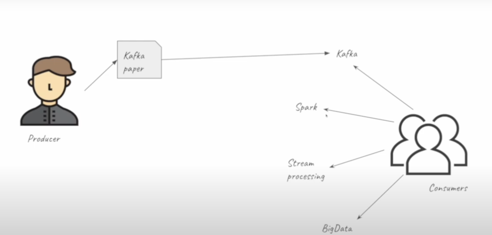
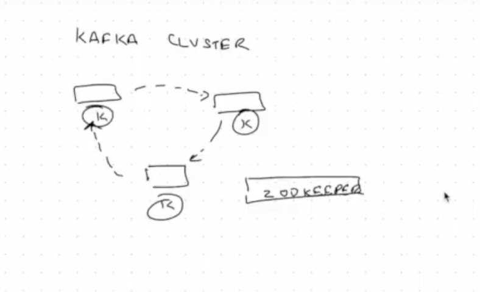
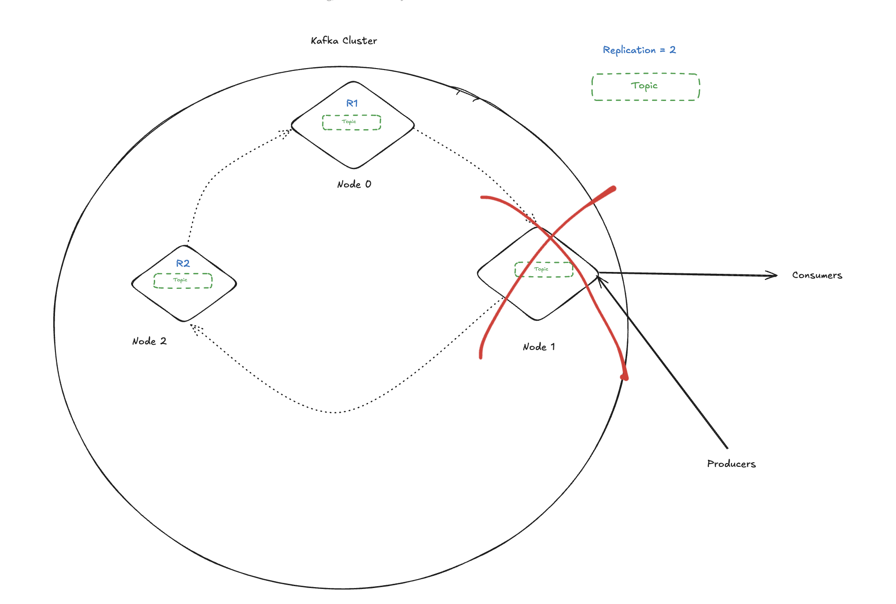
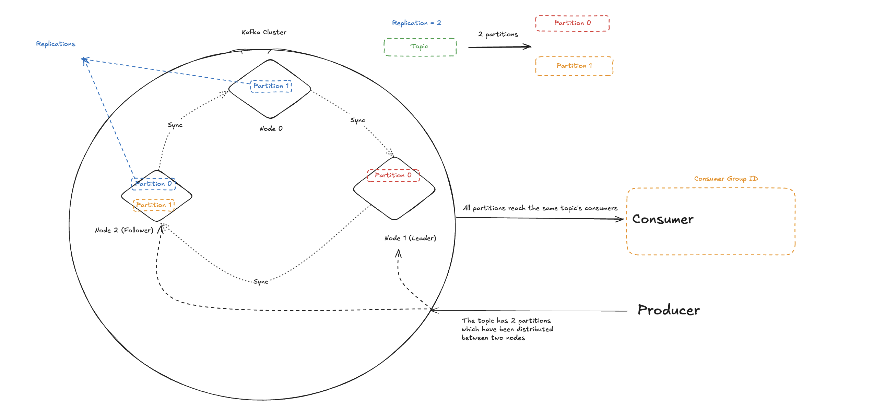
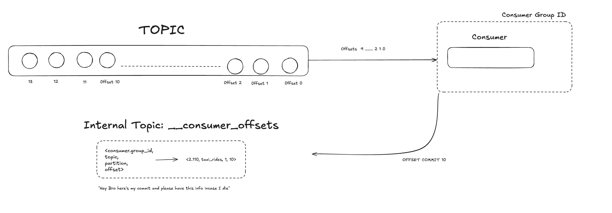

# 📘 Introduction to Stream Processing

## What is Stream Processing?

We will explore what stream processing means and how it differs from traditional data exchange methods.

### Real-World Analogy: Postal Service

Think of a traditional postal service. You write a message (data) on a letter and send it via the postal system. Eventually, it reaches the intended receiver. This is a simple form of **batch data exchange**—it's not immediate, and there's a delay.

### In Software: APIs

In modern software systems, data is exchanged through technologies like:

- REST APIs  
- GraphQL  
- Webhooks  

These enable one system (producer) to send information to another (consumer).

### Analogy: The Public Notice Board

A **notice board** is a helpful metaphor to understand data flow:

- A **producer** posts flyers (data) on the board.
- **Consumers** walk by and read these flyers, if they’re interested.

You can extend this analogy:

- Consumers might only be interested in certain **topics** (e.g., `Kafka`, `Spark`, `Big Data`).
- Producers post flyers under these topics.
- Consumers subscribed to those topics receive only relevant information.

This mimics a **pub-sub model** (publish-subscribe), common in streaming systems like **Kafka**.



<br>

---

## What is Stream Processing?

Now that we understand data exchange, let’s talk about **stream processing** specifically.

### Batch vs Stream

| Batch Processing              | Stream Processing               |
|------------------------------|----------------------------------|
| Data is collected and sent in chunks (e.g., hourly, daily) | Data is sent and received in near real-time |
| Example: Email notifications | Example: Kafka topics, Spark streaming |
| Often delayed                | Much faster and continuous       |

In **stream processing**, the goal is to move from periodic/batch data to **continuous** data flow.

### What is Real-Time, Really?

> Real-time does NOT mean "instantaneous".

Instead, real-time generally means a few seconds of delay, as opposed to hours or days. This latency is small enough to support applications like:

- Fraud detection  
- Real-time analytics  
- Monitoring systems


## Kafka

Kafka has various terms like producer, consumer and topics. Let us look into each one of them in the following sections 

### 1. What is a Topic?

A **topic** is essentially a *named stream of events*.  
You can think of it as a category or feed to which records (events) are published.

- Every topic represents a continuous flow of data.
- Producers write events to a topic.
- Consumers read events from a topic.
- Topics are partitioned internally, allowing Kafka to scale horizontally and handle very large volumes of data.

In simple terms, if your application generates data over time, that data flows into a topic.

---

### 2. What is an Event?

An **event** (sometimes called a **record** or **message**) is the individual piece of data that gets written to a topic.

Let’s look at a concrete example:

Imagine you’re building an application that records the temperature in a room every 30 seconds.

- **Each event** answers the question:  
  *What was the temperature in the room at a specific point in time?*
- For instance:  
  *32°C recorded at 2:00 PM.*
- Thirty seconds later, a new reading is taken, creating another event.
- Over time, these events form a time-ordered sequence of measurements.

These individual data points—each with a value and a timestamp—are collected into the topic.

Once events are published, they stay in the topic for a configurable retention period (by default, 7 days), during which consumers can read and process them independently.

---

#### Additional Insights

- **Producers**: Applications or services that create and send events to Kafka topics.
- **Consumers**: Applications or services that subscribe to topics to read and process events.
- **Partitions**: Each topic is split into partitions to distribute load and provide parallelism.
- **Offsets**: Every event in a partition has a unique offset, which acts as its position in the log. Consumers track offsets to know what they’ve already processed.

Kafka is designed to **decouple producers and consumers**, so producers don’t need to know who will consume their data, and consumers can read the data at their own pace.


### 3. Event Structure

At a minimum, an event contains:

- **Key** (optional): Used to determine the partition within the topic.
- **Value**: The actual data payload of the event.
- **Timestamp**: The time when the event was produced or logged.
- **Metadata**: Additional information such as headers or the offset in the partition.

Let’s break down each part:

#### Key

The key is optional.
- When present, Kafka uses it to decide which partition an event should go to.
- Common use cases:
  - Grouping related events (e.g., all events for the same user or order).
  - Ensuring ordering guarantees within a partition.

**Example:**  
If you have a topic recording temperature readings by sensor ID, the sensor ID could be the key.

---

#### Value

- The value holds the main content of the event.
- It can be anything: a string, JSON, Avro, Protobuf, or any binary data.
- Most of the time, this is what consumers are interested in processing.

**Example Value:**  
```json
{
  "sensorId": "sensor-123",
  "temperature": 32,
  "unit": "C",
  "recordedAt": "2025-06-26T14:00:00Z"
}
```

#### Timestamp

- Every event has a timestamp assigned when it is produced
- This timestamp can be set by the producer or by the Kafka broker when the event is received
- Timestamps help consumers understand when the event occurred

#### Putting it all together

| Field         | Example Value             |
| ------------- | ------------------------- |
| **Key**       | `sensor-123`              |
| **Value**     | `{ "temperature": 32 }`   |
| **Timestamp** | `2025-06-26T14:00:00Z`    |
| **Headers**   | `{"trace-id": "abc-123"}` |
| **Offset**    | `42`                      |


### 4. Reliability

Kafka provides a unique combination of obustness, scalability, and flexibility that makes it stand out:

- **Robustness and Reliability**
  - Even if servers or nodes go down, you will still receive your data.
  - This is achieved through **replication**: Kafka automatically replicates data across multiple nodes so it remains durable and available.

- **Flexibility**
  - Topics can be small or huge—Kafka handles both gracefully.
  - You can have a single consumer or hundreds of consumers reading from the same topic independently.
  - With integrations like **Kafka Connect** (for connecting to databases and other systems) and **ksqlDB** (for stream processing using SQL), you get powerful tools to build end-to-end data pipelines.

- **Tiered Storage**
  - Kafka offers **tiered storage**, letting you keep all your event history cost-effectively.
  - You can replay or reprocess old data later for offline analytics or audits.

- **Scalability**
  - Kafka scales horizontally.
  - If your workload grows from 10 events per second to 1,000 or 100,000 events per second, Kafka can handle the increase seamlessly by adding more brokers and partitions.
 

## Kafka Configuration

In the previous sections, we learnt about producers and consumers in Kafka using.

We mentioned several terms—**partitions**, **retention**, **replication**, **acks**, consuming from **latest** or **earliest**, and **auto commit offset**—but didn’t dive deep into them. Let us dive deeper into what these mean - 

### Kafka Cluster

<br>


<br>

All three nodes:
- Run Kafka brokers
- Are part of the same **cluster**
- Coordinate to maintain data consistency and availability

> **Note:**  
In earlier Kafka versions, **ZooKeeper** was used for cluster metadata management:
- Tracking topics, partitions, and offsets
- Leader election
- Configuration storage

Modern Kafka (since v2.8) **no longer requires ZooKeeper**.  
Kafka has replaced ZooKeeper with **KRaft mode (Kafka Raft Metadata mode)**:
- Metadata is stored internally as a special topic
- Nodes replicate this metadata to maintain consistency
- This simplifies deployment and scaling

### Reliability

<br>


<br>

Kafka achieves **reliability and fault tolerance** via:
- **Replication**
- **Leader election**

Consider a cluster with:
- Node 0
- Node 1
- Node 2

Suppose:
- The `rides` topic is stored on **Node 1 only**
- Producers and consumers connect to Node 1

If **Node 1 fails**, the topic is **unavailable**, and producers/consumers cannot continue.

**Replication** addresses this:

1. You set a **replication factor**, e.g., `2`.
2. The topic is replicated across Node 1 and Node 2
3. Kafka designates:- A **leader partition** (e.g., Node 1) and One or more **followers** (Node 0 & Node 2)

**Write flow:**
- Producers send data to the **leader** (Node 1).
- The leader appends the message to its log.
- The leader **replicates** the message to followers.

If **Node 1 fails**:
- Kafka automatically promotes **Node 0** to **leader**.
- Clients (producers/consumers) reconnect to Node 0.
- Service resumes with minimal disruption (some lag).

> **Note:**  
This automatic failover is one reason Kafka is often used for **mission-critical streaming pipelines**.

### Replication Factor

**Replication factor** determines **how many copies** of your topic are maintained.  
Common settings:
- `1`: No redundancy
- `2`: One backup
- `3`: High availability

This is a **critical configuration**, especially in production, as it impacts:
- Fault tolerance
- Disk usage
- Performance

### Retention

Kafka topics don’t store data **forever** by default.  
**Retention** specifies **how long messages are kept** before deletion.

Example:
- Retention: `1 day`
- After 24 hours, messages are automatically **deleted**.
- Useful for:
  - Limiting disk usage
  - Ensuring compliance (data expiry)

Kafka performs retention cleanup efficiently because logs are **append-only**:
- Kafka periodically checks timestamps
- Messages older than retention threshold are purged

> **Note:**  
You can also configure retention based on **size**, e.g., keep 10GB of data regardless of time.

### Partitions

Partitions are the fundamental mechanism that allow Kafka to **scale horizontally** and achieve high throughput.  

When you create a topic in Kafka, you define how many partitions it should have. Each partition is an **ordered, immutable sequence of messages**, continually appended to as new messages arrive. A partition is also the unit of parallelism and scalability:  

Imagine you have a topic called `taxi_rides`, and you set its partitions to 2. What you are essentially doing is splitting the topic into **two separate append-only logs**:

```
Partition 0: [ message 1, message 2, message 3, ... ]
Partition 1: [ message 4, message 5, message 6, ... ]
```
<br>


### Combining Partitions, Replications, Reliability and Topics

<br>



<br>

Each partition is replicated across Kafka brokers to ensure reliability. For example:

- Partition 0 can be stored on **Node 0** (leader) and replicated to **Node 2** (follower)
- Partition 1 can be stored on **Node 2** (Follower) and replicated to **Node 0** (follower)

These replicas ensure that if a broker goes down, another broker has a copy and can take over as leader.

When consumers read data, **only one consumer from a consumer group can read from each partition**. This is why partitions are so important for scaling out consumption:

1. If you have **one partition**, then no matter how many consumers you start, only one can actively consume.
2. If you have **two partitions**, up to two consumers can consume in parallel.
3. If you add a third consumer to the same group while you only have two partitions, one consumer will remain idle.
4. If a consumer fails, Kafka will automatically reassign the partition it was reading to another active consumer in the group.

This model ensures:
- Higher throughput (parallel processing).
- Reliability (replication).
- Ordered processing within each partition.

In practice, if your consumers are slower than the rate of incoming messages (e.g., because they are making slow API calls), you can **increase the number of partitions** and add more consumers to the same consumer group to process messages in parallel.

> **Tip:** Always plan the number of partitions carefully. Too few and you can’t scale out; too many and you can overload brokers and consumers.

<br>

### Offsets



Offsets in Kafka are the mechanism that allow consumers to keep track of which messages they have already processed from a topic partition.

Every message stored in a Kafka partition is assigned a unique, sequential number called the **offset**. For example, messages in a partition might look like this:

```
Offset 0 | Offset 1 | Offset 2 | ... | Offset N
```

When a consumer reads messages from a partition, it uses offsets to know where it is in the log. After consuming messages, the consumer **commits** the offset of the last message it has processed. 

This commit tells Kafka:  
> "I have successfully processed up to this offset; the next time I start, resume from the following offset."

Kafka stores committed offsets in a special INTERNAL TOPIC named: `__consumer_offsets`

This topic holds records that associate:
- The **consumer group ID** (which identifies the group of consumers working together)
- The **topic**
- The **partition**
- The **last committed offset**

When a consumer restarts or recovers from a failure, it can look up its last committed offset in `__consumer_offsets` and continue consuming from exactly where it left off, rather than reprocessing messages it already handled.

This approach ensures:
- No duplication (already-processed messages are skipped)
- No data loss (nothing is missed)
- Coordinated progress across consumers in the same group

For example, if your consumer had committed offset 10, the next fetch after restart will start reading at offset 11.

This combination of:
- Offsets per message
- Committed offsets per consumer group
- Partitioned topic data

<br>

### Topic configurations

* `retention.ms`: due to storage space limitations, messages can't be kept indefinitely. This setting specifies the amount of time (in milliseconds) that a specific topic log will be available before being deleted.
* `cleanup.policy`: when the `retention.ms` time is up, we may choose to `delete` or `compact` a topic log.
    * Compaction does not happen instantly; it's a batch job that takes time.
* `partition`: number of partitions.
    * The higher the amount, the more resources Kafka requires to handle them. Remember that partitions will be replicated across brokers; if a broker dies we could easily overload the cluster.
* `replication`: replication factor; number of times a partition will be replicated.

### Consumer configurations

* `offset`: sequence of message IDs which have been read by the consumer.
* `consumer.group.id`: ID for the consumer group. All consumers belonging to the same group contain the same `consumer.group.id`.
* `auto_offset_reset`: when a consumer subscribes to a pre-existing topic for the first time, Kafka needs to figure out which messages to send to the consumer.
    * If `auto_offset_reset` is set to `earliest`, all of the existing messages in the topic log will be sent to the consumer.
    * If `auto_offset_reset` is set to `latest`, existing old messages will be ignored and only new messages will be sent to the consumer.

### Producer Acknowledgment

Kafka producers can configure the `acks` setting to control message delivery guarantees. This setting defines how many broker acknowledgments the producer must receive before considering a write successful.

- `acks=0` (Fire-and-Forget)
The producer does **not wait** for any acknowledgment from the broker. This is the **fastest** option but also the **least reliable**—if the leader broker goes down, the message may be lost. Suitable for non-critical data such as metrics, logs, or CPU usage samples where occasional message loss is acceptable.

- `acks=1`
The producer waits for an acknowledgment **only from the leader broker**. The message is considered successfully sent once the leader has written it to its local log. However, if the leader fails before replicating the message to followers, the message can be lost. This is a middle ground between speed and reliability.

- `acks=all` (or `acks=-1`)
The producer waits for the message to be **successfully written to the leader and fully replicated to all in-sync replicas (ISRs)**. Only then does the broker acknowledge the write. This provides the **strongest delivery guarantee**, ensuring **no message loss**, but is also the **slowest** option. Ideal for critical data—e.g., financial transactions or audit logs—where reliability is more important than latency.

> Choose the `acks` setting based on your use case. For non-critical, high-throughput data, use `acks=0` or `acks=1`. For mission-critical data where loss is unacceptable, use `acks=all`.


