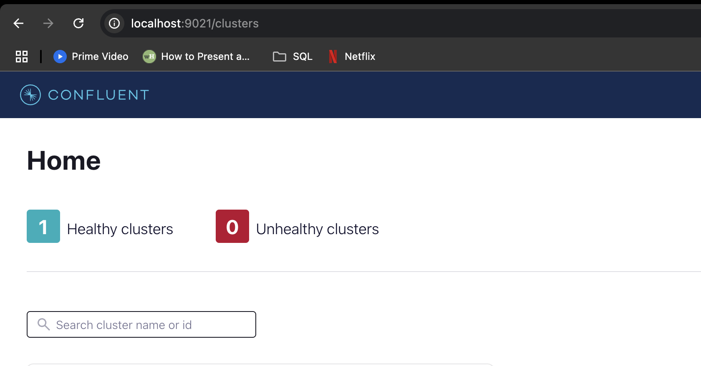

# Kafka install and demo

## Installing Kafka

Install instructions for Kafka can be found in [the official website](https://kafka.apache.org/quickstart#quickstart_kafkaconnect).

Due to the complexity of managing a manual Kafka install, a docker-compose script is provided [in this link](../6_streaming/docker-compose.yml). The Docker images are provided by [Confluent](https://www.confluent.io/), a Kafka tool vendor. The script defines the following services:

* **[`zookeeper`](https://zookeeper.apache.org/)**: a centralized service for maintaining configuration info. Kafka uses it for maintaining metadata knowledge such as topic partitions, etc.
    * Zookeeper is being phased out as a dependency, but for easier deployment we will use it in the lesson.
* **`broker`**: the main service. A plethora of environment variables are provided for easier configuration.
    * The image for this service packages both Kafka and [Confluent Server](https://docs.confluent.io/platform/current/installation/migrate-confluent-server.html), a set of commercial components for Kafka.
* **`kafka-tools`**: a set of additional Kafka tools provided by [Confluent Community](https://www.confluent.io/community/#:~:text=Confluent%20proudly%20supports%20the%20community,Kafka%C2%AE%EF%B8%8F%2C%20and%20its%20ecosystems.). We will make use of this service later in the lesson.
* **`schema-registry`**: provides a serving layer for metadata. We will make use of this service later in the lesson. 
* **`control-center`**: a web-based Kafka GUI.
    * Kafka can be entirely used with command-line tools, but the GUI helps us visualize things.
* **`kafka-rest`**: Provides a REST API to:
    * Produce and consume Kafka messages over HTTP
    * Manage topics and consumer groups
    * Integrate with clients that can’t run Kafka libraries

Download the script to your work directory and start the deployment with `docker-compose up` . It may take several minutes to deploy on the first run. Check the status of the deployment with `docker ps` . Once the deployment is complete, access the control center UI by browsing to `localhost:9021`



<br><br>

## Setting up a kafka and python 3

cd into the right directory and 

```
python3 -m venv .venv

source .venv/bin/activate

pip install kafka-python
```

